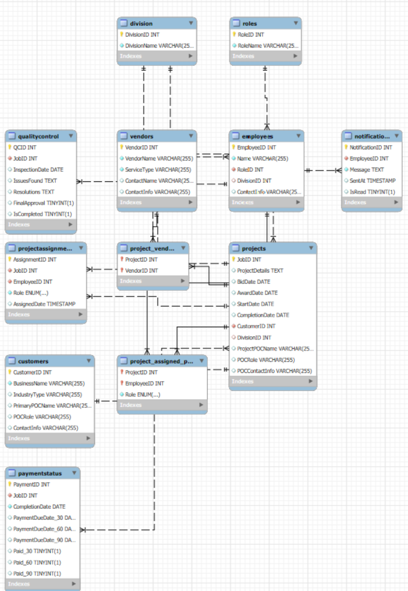
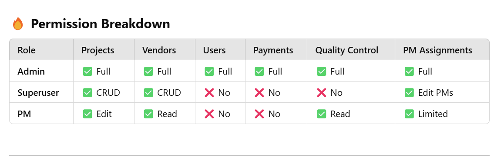

# Remediation Project Management DBMS

Relational database and database management system project designed to support project tracking, customer and vendor management, quality control, personnel assignments, and accounts-receivable reporting within a remediation operations environment.

## Overview

This project was developed to centralize operational data for a small commercial waterproofing and remediation organization. The database was designed to improve project visibility, reduce compartmentalized information, support staff transitions, and provide a foundation for reporting, historical analysis, and workflow automation.

The system includes data structures for projects, customers, employees, vendors, divisions, user roles, quality-control records, payment status, notifications, and project assignments.

## Project Goals

* Centralize project and operational data
* Improve project tracking and management visibility
* Support vendor and subcontractor coordination
* Track quality-control inspections and issue resolution
* Associate employees and project managers with assigned projects
* Improve financial and accounts-receivable oversight
* Support future reporting and automation opportunities

## Technologies and Concepts

* MySQL
* SQL
* Relational database design
* Entity-relationship modeling
* Primary and foreign keys
* Junction tables
* CRUD operations
* SQL joins
* Role-based access control
* Data reporting
* Web application integration

The project reached a stage where the database was populated, a webpage had been integrated, and CRUD forms had been published in beta form, with security refinement and application debugging identified as remaining work.

## Data Model

The database uses a relational structure centered on project operations.

Major entities include:

* **Projects** — project details, dates, customer relationships, division, and customer point-of-contact information
* **Customers** — customer organizations, industry type, and primary contacts
* **Employees** — personnel information linked to roles and divisions
* **Vendors** — third-party service providers and contact information
* **Quality Control** — inspections, identified issues, resolutions, approvals, and completion status
* **Payment Status** — project completion and payment-status tracking
* **Roles** — organizational role definitions
* **Divisions** — organizational business units
* **Notifications** — employee-linked system messages
* **Project assignments** — relationships between projects and assigned personnel
* **Project vendors** — many-to-many relationships between projects and vendors

### Entity-Relationship Diagram

## Role-Based Access

The project incorporates role-based access concepts to separate administrative, operational, and project-management responsibilities.

The documented permission model includes:

* **Admin** — full access across projects, vendors, users, payments, quality control, and project-manager assignments
* **Superuser** — CRUD access to projects and vendors with more limited administrative and financial access
* **Project Manager** — project editing, vendor read access, quality-control visibility, and limited assignment privileges

This model was intended to support role segregation, data security, and accountability within the system.

## Featured SQL Queries

### Accounts Receivable Reporting

[`queries/accounts-receivable-report.sql`](queries/accounts-receivable-report.sql)

This query identifies projects that:

* have been completed,
* remain unpaid after 30 days,
* and require customer and project-manager contact information for follow-up.

It joins project, payment-status, customer, project-assignment, and employee data to produce an operational accounts-receivable report.

### Completed Projects and Quality Control

[`queries/completed-project-qc-report.sql`](queries/completed-project-qc-report.sql)

This query returns completed projects along with available:

* quality-control inspection information,
* identified issues,
* resolutions,
* final approval status,
* customer information,
* and assigned project-manager information.

`LEFT JOIN` operations allow completed projects to remain visible even when a corresponding quality-control inspection record does not yet exist.

### Basic Query Examples

[`queries/basic-queries.sql`](queries/basic-queries.sql)

Includes examples of:

* selecting specific columns,
* retrieving complete tables,
* filtering by primary key,
* and ordering quality-control records by inspection date.

## Supporting Artifacts

The `doc/` directory contains selected implementation evidence from the project, including:

* entity-relationship diagram
* permission model
* project and personnel assignment examples
* quality-control records
* table-schema examples

All displayed database records used for project demonstration were dummy or test records.

## Current Status and Limitations

The available project materials document a working database design, populated test data, web integration, CRUD development, SQL reporting, and role-permission work.

Security refinement and web-application CRUD debugging remained identified backlog items during the documented development period.

The original authoritative database DDL/export is not currently included in this repository. A future revision may add a reproducible `schema.sql` if the original MySQL project files are recovered.

## Lessons Demonstrated

This project demonstrates practical experience with:

* translating operational requirements into relational data structures
* modeling entity relationships and dependencies
* using SQL to support real business questions
* developing multi-table reporting queries
* incorporating access-control concepts into database design
* connecting database design to project, financial, and quality-control workflows

The project also reinforced the importance of designing systems around how information is actually used operationally rather than treating database implementation as an isolated technical exercise.

