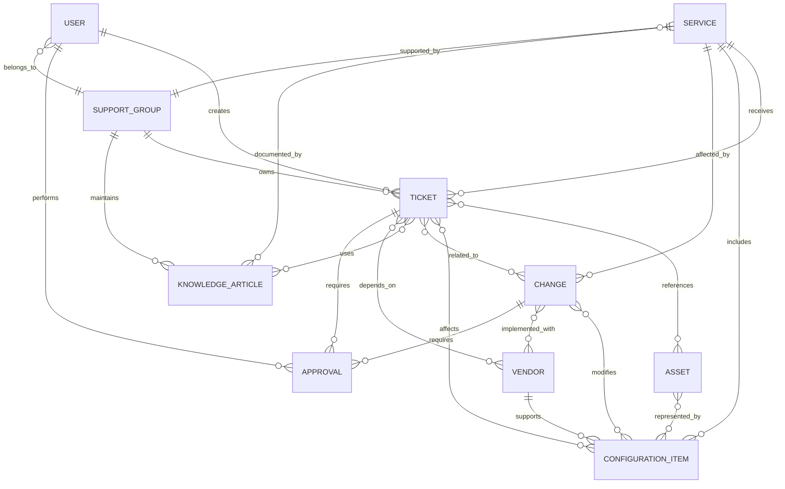

# Service Management Data Model

## Purpose

The service-management data model defines the core entities and relationships required to support the target Enterprise Service Management operating model.

The objective is not to build a massive configuration database.

It is to make sure the records that matter are connected well enough to support:

* ownership
* troubleshooting
* approval
* change traceability
* vendor accountability
* knowledge reuse
* reporting
* auditability

The operating principle is:

> **Capture relationships that support real decisions. Do not collect data just because the platform has a field for it.**

This model supports:

* [Target Operating Model](../03%20Target%20Service%20Model/target%20operating%20model.md)
* [Incident Management](../04%20Workflow%20Design/incident%20management.md)
* [Service Request Management](../04%20Workflow%20Design/service%20request%20management.md)
* [Change Management](../04%20Workflow%20Design/change%20management.md)
* [Knowledge Management](../04%20Workflow%20Design/knowledge%20management.md)

---

# 1. Core Entities

The target model uses ten primary entities.

| Entity             | Purpose                                                                      |
| ------------------ | ---------------------------------------------------------------------------- |
| User               | Represents requester, affected user, approver, technician, sponsor, or owner |
| Ticket             | Represents Incident or Service Request activity                              |
| Service            | Represents a supported business or technical service                         |
| Support Group      | Represents the team responsible for service work                             |
| Asset              | Represents a managed physical or logical asset                               |
| Configuration Item | Represents a component relevant to service delivery                          |
| Change             | Represents planned technical change                                          |
| Knowledge Article  | Represents reusable operational knowledge                                    |
| Vendor             | Represents an external service or support provider                           |
| Approval           | Represents a structured authorization decision                               |

These entities form the minimum logical model needed to support the workflows already defined.

---

# 2. Core Relationship View

At a high level, the model connects service activity like this:

```text id="r3yyi1"
User
  ↓
Ticket
  ↓
Service
  ↓
Support Group
```

Operational context then extends that record:

```text id="c80xvb"
Ticket
├── Asset
├── Configuration Item
├── Change
├── Knowledge Article
├── Vendor
└── Approval
```

The point is not that every ticket must use every relationship.

The point is that the platform can represent the context when the process needs it.

---

# 3. Mermaid ER Model



A polished visual will be maintained in:

[Service Management Data Model Diagram](../diagrams/service%20management%20data%20model.md)

---

# 4. Entity Definitions

## 4.1 User

The User entity represents people participating in service workflows.

Possible roles include:

* requester
* affected user
* technician
* approver
* service owner
* manager
* vendor sponsor

Representative attributes:

| Attribute         | Purpose                           |
| ----------------- | --------------------------------- |
| User ID           | Unique identity                   |
| Name              | Display identity                  |
| Department        | Organizational context            |
| Manager           | Approval / hierarchy relationship |
| Location          | Routing / support context         |
| Employment Status | Lifecycle validation              |
| Support Group     | Technician or support membership  |
| Role              | Access / workflow behavior        |

User information should come from an authoritative identity source where practical.

---

## 4.2 Ticket

The Ticket entity represents managed service activity.

In this case, the primary ticket types are:

* Incident
* Service Request

Representative attributes:

| Attribute           | Purpose                       |
| ------------------- | ----------------------------- |
| Ticket ID           | Unique record                 |
| Type                | Incident / Service Request    |
| Requester           | Who initiated work            |
| Affected User       | Who is impacted               |
| Service             | Relevant supported service    |
| Category            | Classification                |
| Priority            | Operational priority          |
| Status              | Workflow state                |
| Owning Group        | Current accountable team      |
| Assigned Technician | Current individual assignment |
| SLA Status          | Service commitment state      |
| Created             | Intake timestamp              |
| Resolved            | Resolution timestamp          |
| Closed              | Final closure timestamp       |

The Ticket is the primary transactional record for day-to-day service activity.

---

# 5. Service

The Service entity represents the business or technical capability being supported.

Examples:

* Business Email
* Remote Access
* Enterprise Scheduling
* End-User Computing
* Identity Services

Representative attributes:

| Attribute      | Purpose                     |
| -------------- | --------------------------- |
| Service ID     | Unique service              |
| Service Name   | User / management reference |
| Service Owner  | Accountable owner           |
| Support Group  | Primary support             |
| Criticality    | Business importance         |
| Support Window | SLA calendar                |
| Status         | Active / Retired            |

Service relationships support:

* routing
* priority
* SLA
* ownership
* reporting
* change impact

---

# 6. Support Group

The Support Group entity represents operational ownership.

Examples:

* Service Desk
* Endpoint Support
* Network Support
* Application Support
* Identity and Access

Representative attributes:

| Attribute          | Purpose              |
| ------------------ | -------------------- |
| Group ID           | Unique group         |
| Group Name         | Operational identity |
| Group Lead         | Escalation           |
| Supported Services | Ownership scope      |
| Queue              | Work intake          |
| Escalation Group   | Next-level support   |

Support-group design is detailed in:

[Ownership and Escalation](../03%20Target%20Service%20Model/ownership%20and%20escalation.md)

---

# 7. Asset

The Asset entity represents managed resources with lifecycle or ownership significance.

Examples:

* laptop
* desktop
* monitor
* mobile device
* server hardware
* licensed appliance

Representative attributes:

| Attribute     | Purpose                         |
| ------------- | ------------------------------- |
| Asset ID      | Unique asset                    |
| Asset Type    | Classification                  |
| Assigned User | Custodian                       |
| Location      | Physical context                |
| Status        | In Service / Stock / Retired    |
| Vendor        | Supplier / support relationship |
| Warranty      | Support context                 |

Asset and CI are related but not identical concepts.

An asset is often managed because of ownership, lifecycle, or financial value.

A CI is managed because it matters to service delivery or configuration.

---

# 8. Configuration Item

The Configuration Item entity represents a technical component whose state or relationship matters to service delivery.

Examples:

* application
* server
* network device
* database
* endpoint
* cloud service
* interface

Representative attributes:

| Attribute     | Purpose                        |
| ------------- | ------------------------------ |
| CI ID         | Unique CI                      |
| CI Type       | Classification                 |
| Name          | Technical identifier           |
| Service       | Supported service relationship |
| Owner         | Responsible party              |
| Support Group | Technical support              |
| Status        | Operational state              |
| Vendor        | External support relationship  |

The model intentionally avoids attempting to capture every possible technical object.

The CI set should be limited to records that provide operational value.

---

# 9. Change

The Change entity represents planned modification to the environment.

Representative attributes:

| Attribute        | Purpose                       |
| ---------------- | ----------------------------- |
| Change ID        | Unique record                 |
| Change Type      | Standard / Normal / Emergency |
| Change Owner     | Lifecycle accountability      |
| Risk             | Risk classification           |
| Status           | Workflow state                |
| Affected Service | Impact context                |
| Affected CI      | Technical context             |
| Implementer      | Technical execution           |
| Outcome          | Success / Issue / Failure     |
| Backout Status   | Recovery state                |

Change relationships are critical to post-implementation troubleshooting.

---

# 10. Knowledge Article

The Knowledge Article entity represents reusable operational guidance.

Representative attributes:

| Attribute   | Purpose                     |
| ----------- | --------------------------- |
| Article ID  | Unique record               |
| Title       | Search / reference          |
| Owner       | Content accountability      |
| Audience    | Access scope                |
| Service     | Operational context         |
| Status      | Draft / Published / Retired |
| Review Date | Lifecycle control           |
| Usage Count | Reuse measure               |

Knowledge may be linked directly to:

* incidents
* requests
* services
* support groups

---

# 11. Vendor

The Vendor entity represents an external organization supporting services, assets, CIs, or changes.

Representative attributes:

| Attribute            | Purpose                       |
| -------------------- | ----------------------------- |
| Vendor ID            | Unique vendor                 |
| Vendor Name          | Organization                  |
| Supported Service    | Service relationship          |
| Supported CI / Asset | Technical relationship        |
| Internal Owner       | Organizational accountability |
| Support Contact      | Escalation                    |
| Status               | Active / Inactive             |

Vendor records should support internal accountability.

They should not imply that the vendor owns the organization's service outcome.

---

# 12. Approval

The Approval entity represents a structured authorization decision.

Representative attributes:

| Attribute     | Purpose                                    |
| ------------- | ------------------------------------------ |
| Approval ID   | Unique decision                            |
| Parent Record | Request or Change                          |
| Approver      | Decision maker                             |
| Approval Type | Manager / System Owner / Security / Change |
| Decision      | Approved / Rejected                        |
| Decision Time | Auditability                               |
| Comments      | Decision context                           |

Approval is modeled separately because it is a decision record, not just another ticket status.

---

# 13. Required vs Optional Relationships

Not every record needs every relationship.

The following table defines the initial design expectation.

| Relationship            | Requirement                          |
| ----------------------- | ------------------------------------ |
| Ticket → Requester      | Required                             |
| Ticket → Owning Group   | Required while active                |
| Ticket → Service        | Required where identifiable          |
| Ticket → Asset          | Conditional                          |
| Ticket → CI             | Conditional                          |
| Ticket → Change         | Conditional                          |
| Ticket → Knowledge      | Optional                             |
| Ticket → Vendor         | Conditional                          |
| Ticket → Approval       | Required where authorization applies |
| Change → Service        | Required                             |
| Change → CI             | Required where applicable            |
| Change → Approval       | Required based on change type        |
| Knowledge → Owner       | Required                             |
| Vendor → Internal Owner | Required                             |

This keeps the data model useful without making every workflow depend on fields that add no value.

---

# 14. Core Relationship Scenarios

## Incident Context

```text id="3xq31o"
User
 ↓
Incident
 ↓
Business Application Service
 ↓
Application CI
 ↓
Recent Change
```

This relationship gives the technician immediate context that may shorten investigation.

---

## Service Request Context

```text id="fk0w44"
User
 ↓
Service Request
 ↓
Catalog Item
 ↓
Service
 ↓
Approval
 ↓
Fulfillment Group
```

This supports repeatable fulfillment and auditability.

---

## Vendor Support Context

```text id="70k26k"
Incident
 ↓
Service
 ↓
CI
 ↓
Vendor
 ↓
Internal Owner
```

This preserves internal accountability even when troubleshooting moves outside the organization.

---

## Change Failure Context

```text id="2sk3tb"
Change
 ↓
CI
 ↓
Service
 ↓
Incident
```

This relationship is one of the most operationally valuable in the model.

It allows responders to see that a relevant change occurred before the service failure.

---

# 15. Relationship Cardinality

The logical model supports several common relationship types.

## One-to-Many

Examples:

```text id="7q4fpk"
Service → Tickets
Support Group → Tickets
Knowledge Owner → Articles
Vendor → Supported CIs
```

---

## Many-to-Many

Examples:

```text id="r4vcrp"
Tickets ↔ CIs
Changes ↔ CIs
Tickets ↔ Knowledge Articles
Services ↔ Support Groups
```

These relationships may be implemented differently depending on the selected platform.

The logical requirement remains the same.

---

# 16. Data Quality Rules

Key data fields should follow several basic rules.

## Required Ownership

Active records cannot exist without a defined operational owner.

## Controlled Reference Data

Values such as:

* service
* support group
* category
* priority
* change type

should use controlled lists rather than uncontrolled free text where consistency matters.

## Valid Relationships

A retired CI should not normally be selected for new active work unless historical context requires it.

## Current Ownership

Services, knowledge, vendors, and CIs should have accountable owners.

---

# 17. Relationship Integrity

The target model should prevent or identify invalid relationships.

Examples:

* ticket assigned to inactive support group
* approval assigned to inactive user
* vendor access tied to expired vendor record
* active service linked only to retired CI
* knowledge article published without owner
* change closed without affected service
* temporary access without expiration

Where possible, these should be prevented at entry.

Where prevention is not practical, they should be detectable through data-quality reporting.

---

# 18. Record History

Material relationship changes should remain traceable.

Examples:

* ownership reassignment
* priority change
* CI relationship change
* vendor association
* approval decision
* change outcome

Historical context is necessary for both auditability and operational review.

---

# 19. Data Sources

The ESM platform should not become the authoritative source for every data domain.

Representative source ownership may look like:

| Data                 | Authoritative Source               |
| -------------------- | ---------------------------------- |
| User identity        | Identity / HR                      |
| Manager relationship | HR / Identity                      |
| Service catalog      | ESM                                |
| Ticket data          | ESM                                |
| Support groups       | ESM / Identity                     |
| Asset data           | Asset Management                   |
| CI data              | ESM / Discovery / Technical Owners |
| Vendor master data   | Procurement / Vendor Management    |
| Approval history     | ESM                                |
| Knowledge            | ESM                                |
| Change records       | ESM                                |

This reduces duplicate ownership.

The ESM platform should consume authoritative data where appropriate rather than quietly becoming a second master record.

---

# 20. Data Ownership

Each major data domain should have an accountable owner.

| Data Domain     | Owner                         |
| --------------- | ----------------------------- |
| Users           | HR / Identity                 |
| Services        | Service Owners                |
| Support Groups  | IT Management                 |
| Assets          | Asset Management              |
| CIs             | Technical / CI Owners         |
| Vendors         | Vendor / Procurement Owner    |
| Knowledge       | Knowledge / Service Owner     |
| Approval Rules  | Process Owners                |
| Categories      | Service Management Owner      |
| SLA Definitions | Service Owner / IT Management |

Technical administrators may maintain the configuration.

They should not automatically become the business owner of the data.

---

# 21. Minimal CI Model

The initial implementation should avoid an oversized CMDB effort.

The first CI population should focus on components that materially support:

* incident troubleshooting
* change impact
* vendor support
* service ownership

Representative initial CI classes:

```text id="i4i92n"
Business Service
Application
Server
Network Device
Endpoint
Database
Integration
```

Additional CI classes should be introduced only when they support a defined operational use case.

---

# 22. Service-to-CI Relationship

A service may depend on multiple configuration items.

Example:

```text id="abajcu"
Business Email
   │
   ├── Identity Service
   ├── Messaging Platform
   ├── Network Connectivity
   └── Email Security Gateway
```

This supports impact analysis when:

* a CI fails
* a change is scheduled
* a vendor issue occurs

The objective is usable dependency visibility, not perfect representation of every technical relationship.

---

# 23. Asset vs CI Example

A laptop may exist as both:

**Asset**

because the organization tracks:

* ownership
* lifecycle
* warranty
* assignment

and:

**Configuration Item**

because it matters to:

* incident history
* software configuration
* service support

The physical object is the same.

The management context is different.

The selected ESM platform may represent these as separate records or combined records.

The logical distinction remains useful during design.

---

# 24. Approval Relationship Model

Approvals are linked to the transaction requiring authorization.

```text id="9d5zmx"
Service Request
    ↓
Approval 1
    ↓
Approval 2
```

or:

```text id="l5s9x2"
Change
  ↓
Service Owner Approval
  ↓
Change Authority
```

This structure allows the organization to report:

* approval time
* rejected requests
* approval exceptions
* self-approval attempts
* overdue approvals

---

# 25. Knowledge Relationship Model

Knowledge should connect back to the work that produced or used it.

```text id="pgkoik"
Incident
   ↓
Resolution
   ↓
Knowledge Article
   ↓
Future Incident
```

This creates a practical feedback loop between support work and organizational knowledge.

---

# 26. Vendor Relationship Model

Vendor relationships may exist at several levels.

```text id="brnwx4"
Vendor
├── Service
├── Asset
├── CI
├── Incident
├── Change
└── Temporary Access
```

The model should make it possible to answer:

* Which services depend on this vendor?
* Which active tickets are waiting on this vendor?
* Which assets or CIs does the vendor support?
* Does the vendor currently have temporary access?

That is far more useful than a vendor name stored only in a free-text note.

---

# 27. Reporting Relationships

The data model directly supports operational metrics.

Examples:

| Relationship           | Metric Enabled             |
| ---------------------- | -------------------------- |
| Ticket → Support Group | Reassignment / workload    |
| Ticket → Service       | SLA by service             |
| Ticket → CI            | Repeat incidents by CI     |
| Ticket → Change        | Incidents caused by change |
| Ticket → Knowledge     | Knowledge reuse            |
| Ticket → Vendor        | Vendor dependency time     |
| Ticket → Approval      | Approval cycle time        |
| Asset → User           | Asset support history      |

The quality of reporting therefore depends on relationship quality.

---

# 28. Automation Dependencies

Automation depends on structured data.

Examples:

```text id="hlo2vw"
Service
  ↓
Owning Group
  ↓
Automatic Routing
```

```text id="ypx3mq"
Temporary Access
  ↓
Expiration Date
  ↓
Automatic Disablement / Task
```

```text id="vl7r6i"
CI
 ↓
Service
 ↓
Change Notification
```

This is why automation should follow data-model stability.

Bad relationship data produces bad automation quickly.

---

# 29. AI Dependencies

AI-assisted capabilities may use:

* ticket text
* category
* service
* CI
* prior incidents
* knowledge
* assignment history

Potential functions include:

* categorization
* duplicate detection
* knowledge recommendation
* trend analysis

AI may help interpret unstructured data.

It should not become a substitute for maintaining the structured relationships the operating model depends on.

---

# 30. Data Model Controls

| Control                      | Purpose                        |
| ---------------------------- | ------------------------------ |
| Required ownership           | Prevent unmanaged data domains |
| Controlled reference values  | Improve consistency            |
| Required core relationships  | Support workflow integrity     |
| Inactive-record restrictions | Prevent invalid associations   |
| Approval relationship        | Preserve authorization history |
| Record history               | Preserve auditability          |
| CI ownership                 | Maintain configuration quality |
| Vendor ownership             | Preserve accountability        |
| Review cycles                | Identify stale data            |

Detailed governance will be maintained in:

[Data Governance](./data%20governance.md)

---

# 31. Testing Mapping

Representative data-model tests include:

| Test ID   | Scenario                                              |
| --------- | ----------------------------------------------------- |
| TC-DAT-01 | Incident linked to valid service and CI               |
| TC-DAT-02 | Active ticket cannot reference inactive support group |
| TC-DAT-03 | Change linked to multiple affected CIs                |
| TC-DAT-04 | Ticket linked to related change                       |
| TC-DAT-05 | Vendor dependency retains internal owner              |
| TC-DAT-06 | Approval retains parent request relationship          |
| TC-DAT-07 | Knowledge article linked to incident                  |
| TC-DAT-08 | Temporary access cannot omit expiration               |
| TC-DAT-09 | Published knowledge requires owner                    |

These will be formalized in:

[Testing and UAT](../09%20Testing%20and%20UAT/test%20cases.md)

---

# 32. Data Model Success Criteria

The model is design-ready when:

* core entities are defined
* required relationships are defined
* ownership exists for major data domains
* service relationships support routing and SLA
* incident/change relationships are supported
* vendor relationships are supported
* approvals remain traceable
* knowledge relationships are supported
* CI scope is intentionally limited
* authoritative data sources are identified
* invalid relationship conditions are understood
* representative tests exist

---

# 33. Service Management Data Model Conclusion

The target data model is intentionally smaller than what a mature enterprise platform could support.

That is a design choice.

The organization does not need every possible relationship on day one.

It needs the relationships that make the workflows already defined work better.

At minimum, the platform should be able to connect:

**People → Work → Services → Technology → Decisions → Outcomes**

Once those relationships are reliable, the organization can expand the model based on actual operational need.

Until then, more data is not automatically better data.

**Next:** [Entity Relationships](./entity%20relationships.md)
