# Change Management Workflow

## Purpose

This diagram shows how the target Enterprise Service Management model handles Standard, Normal, and Emergency Change.

The objective is to scale control to risk while preserving:

* authorization
* readiness
* implementation evidence
* validation
* recovery
* service traceability

The operating principle is:

> **Change control should reduce avoidable risk without making routine work unnecessarily difficult.**

---

## Change Type Decision

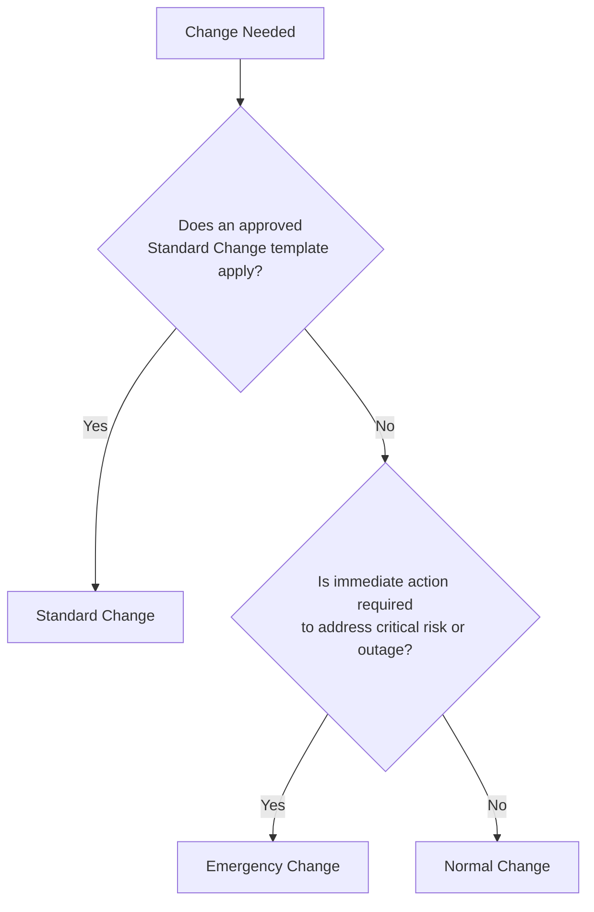

The change type determines the level of assessment and approval required.

It should not be chosen simply because one path is faster.

---

## Core Change Lifecycle

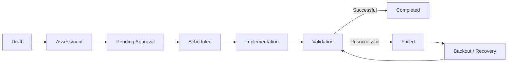

A change should not close as successful simply because implementation activity ended.

Validation determines the outcome.

---

## Standard Change Workflow

Standard Changes are repeatable, documented, and pre-authorized within an approved scope.

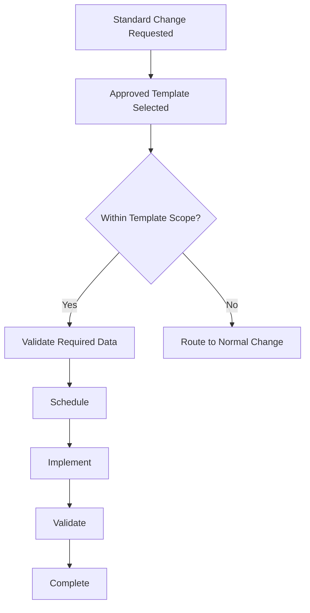

A Standard Change remains standard only while it stays inside the approved template.

If scope, risk, implementation method, or affected service materially changes, the work should move to the appropriate Normal Change path.

---

## Normal Change Workflow

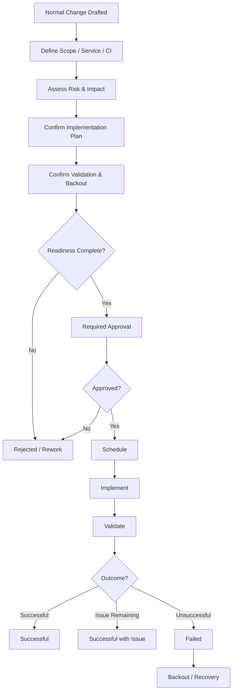

---

## Risk-Based Approval

Approval should scale with risk.

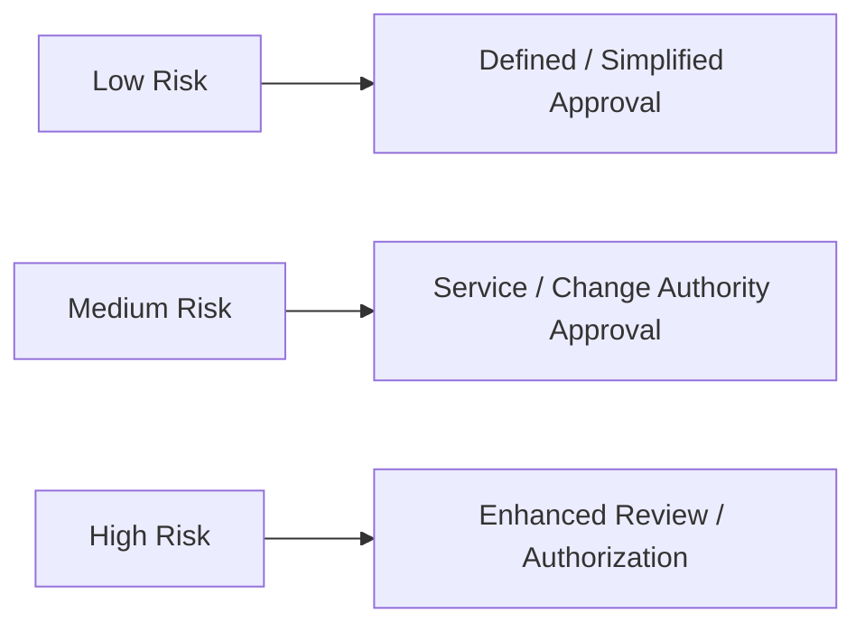

Risk assessment may consider:

* business impact
* service criticality
* number of affected users
* technical complexity
* rollback capability
* security impact
* vendor involvement
* implementation window
* previous change history

The model should remain practical.

Not every field needs a scoring formula if experienced reviewers can make the decision consistently from defined criteria.

---

## Readiness Gate

Before implementation, a Normal or high-risk change should confirm:

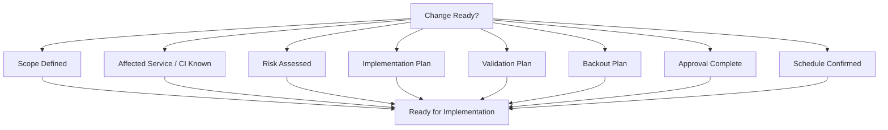

If a critical readiness requirement is missing, the change should not proceed simply because the scheduled window has arrived.

---

## Failed Change Path

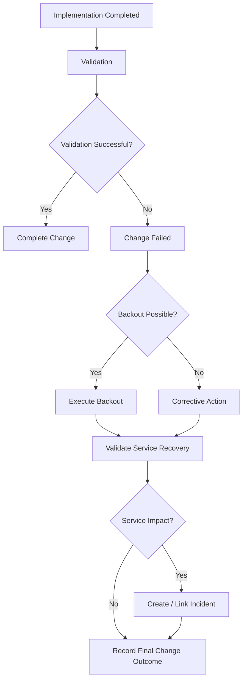

The goal is not to hide failure.

It is to make failure recoverable and traceable.

---

## Change-to-Incident Relationship

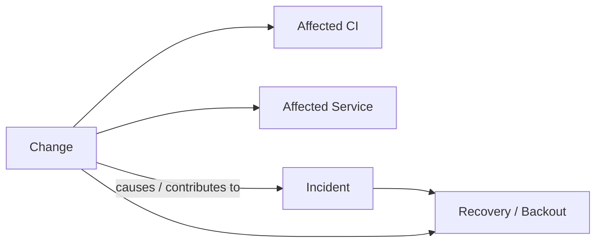

This relationship supports questions such as:

* Which change affected the service?
* Which CI was modified?
* Did the change create an incident?
* Was a backout performed?
* Is the same change pattern failing repeatedly?

---

## Emergency Change Workflow

Emergency Change allows speed while preserving minimum accountability.

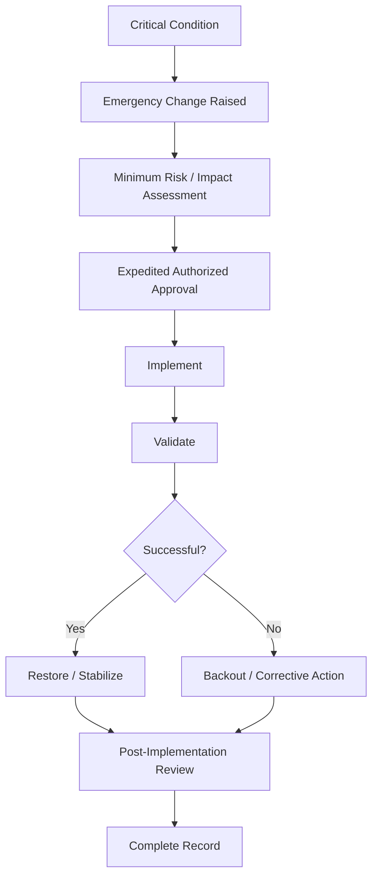

Emergency should mean:

> the normal timing of the process is inappropriate for the operational condition.

It should not mean:

> documentation and accountability are optional.

---

## Emergency Change Retrospective

The retrospective review should confirm:

* why emergency handling was required
* who authorized the change
* what was implemented
* whether service was restored
* whether an incident occurred
* whether a standard or normal change should follow
* whether the emergency could have been prevented

Repeated emergency changes for the same condition should become an improvement signal.

---

## Vendor-Implemented Change

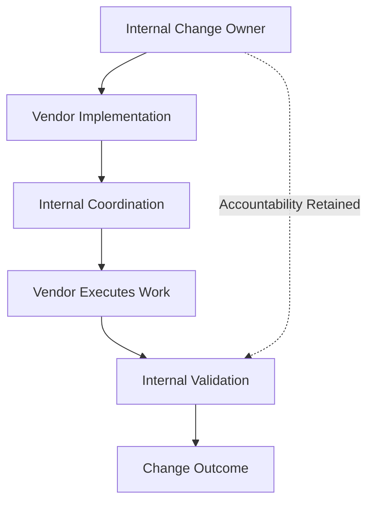

Vendor execution does not remove internal accountability.

The internal Change Owner should still ensure:

* authorization
* schedule
* affected service visibility
* implementation evidence
* validation
* final outcome

---

## Approval and Separation of Duties

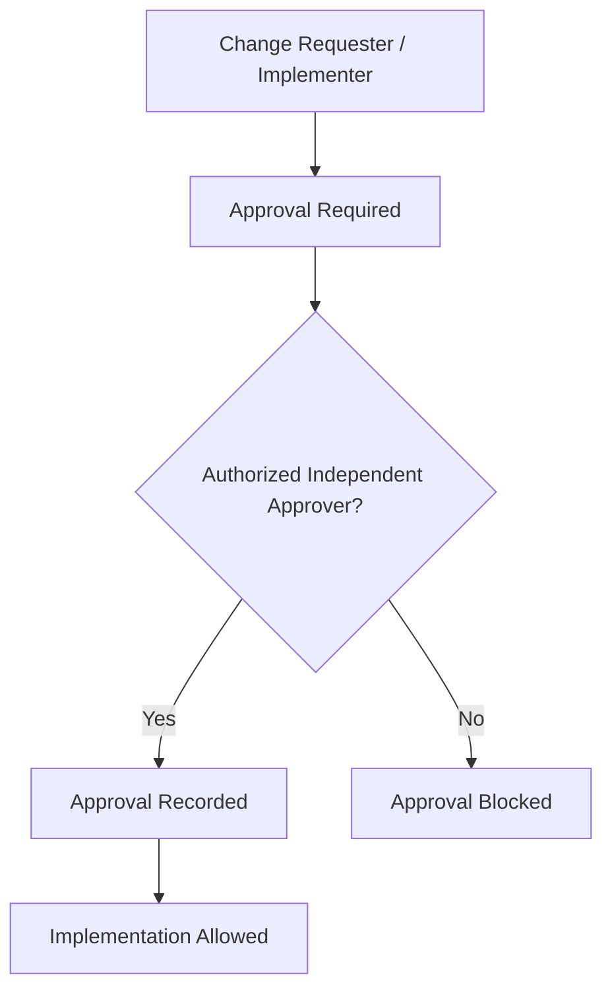

For controlled changes, the person requesting or implementing the activity should not automatically receive authority to approve it.

The level of separation should scale with risk.

---

## Change Closure

A change should close only after:

* implementation result is documented
* validation is complete
* service status is known
* failure or backout is recorded where applicable
* related incidents are linked
* final outcome is accurate

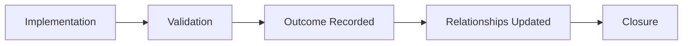

"Work completed" and "change successfully completed" are not necessarily the same thing.

---

## Change Performance Feedback

Change data should feed continuous improvement.

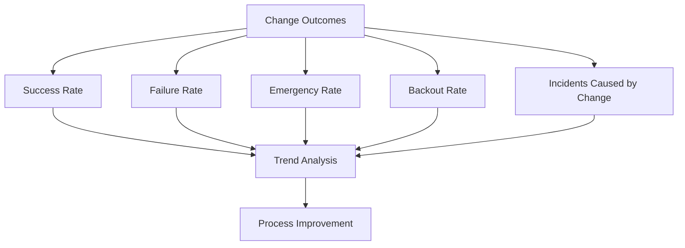

The objective is to improve how reliably the organization changes production.

---

## Change Management Principle

The target change model is designed around three ideas:

1. **Routine work should remain routine.**
2. **Higher risk should receive stronger control.**
3. **Failure should remain visible and recoverable.**

A mature change process should not make every production action difficult.

It should make it difficult to introduce material risk without understanding, authorization, and a recovery path.

> **Control should scale with risk, while accountability remains constant.**
