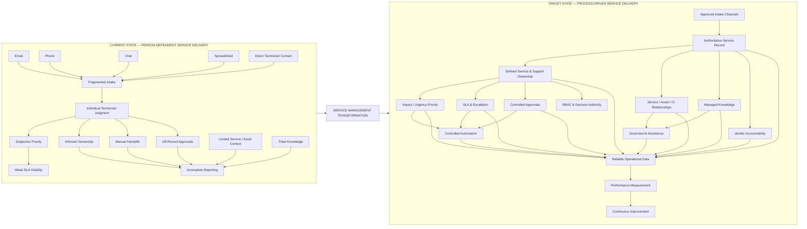

# Current State vs Target Operating Model

## Purpose

This diagram summarizes the primary transformation modeled in the case study.

The current environment depends on fragmented intake, individual coordination, and inconsistent service-management practices.

The target environment establishes controlled intake, visible ownership, defined workflow, governance, and measurable service performance.

---

## Transformation Summary

| Current State                  | Target State                           |
| ------------------------------ | -------------------------------------- |
| Fragmented intake              | Controlled intake                      |
| Technician-dependent decisions | Defined process rules                  |
| Subjective prioritization      | Impact / urgency priority              |
| Informal ownership             | Explicit service and support ownership |
| Manual escalation              | SLA-driven escalation                  |
| Off-record approvals           | Auditable workflow approvals           |
| Limited technical context      | Service / asset / CI relationships     |
| Tribal knowledge               | Managed knowledge lifecycle            |
| Weak vendor visibility         | Internal vendor accountability         |
| Manual repetitive work         | Controlled automation                  |
| Unstructured AI use            | Governed AI assistance                 |
| Weak reporting                 | Reliable operational measurement       |

---

## Design Intent

The target model does not attempt to remove human judgment from service delivery.

It moves that judgment to the places where it is useful.

Technicians still determine how to troubleshoot an issue.

Service owners still make service decisions.

Approvers still decide whether controlled activity should proceed.

What changes is the process surrounding those decisions.

Intake, ownership, priority, approval, escalation, evidence, and measurement become consistent enough that the organization no longer depends on an individual technician remembering how the process is supposed to work.

The transformation can be summarized as:

> **Person-dependent service delivery → Process-driven service delivery**
