# SLA and Escalation Model

## Purpose

This diagram shows how priority, service-level timing, waiting states, warning thresholds, exceptions, and escalation interact in the target Enterprise Service Management model.

The intent is to make service commitments visible without reducing SLA management to a simple breach percentage.

The operating principle is:

> **An SLA should drive attention and action before a service commitment is missed.**

---

## Priority Model

Priority is derived from business impact and urgency.

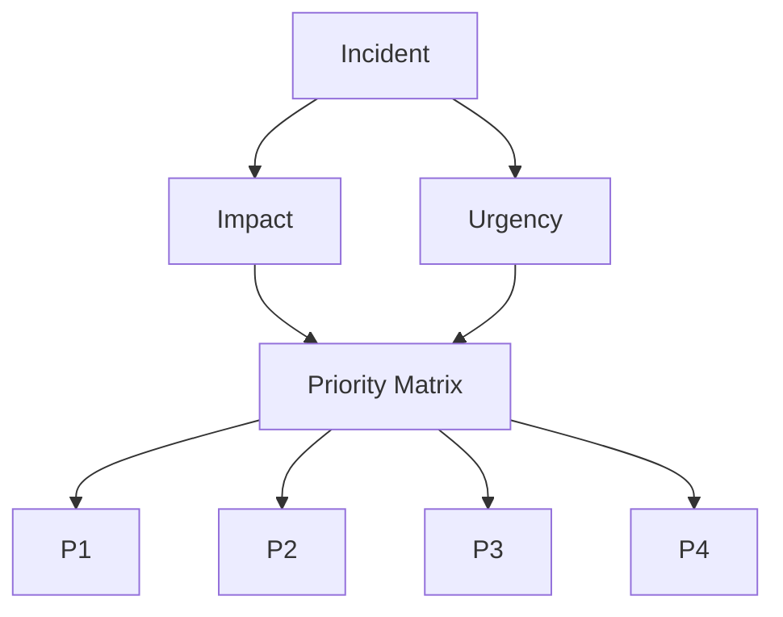

Representative priority matrix:

| Impact | Urgency | Priority |
| ------ | ------- | -------- |
| High   | High    | P1       |
| High   | Medium  | P2       |
| High   | Low     | P3       |
| Medium | High    | P2       |
| Medium | Medium  | P3       |
| Medium | Low     | P4       |
| Low    | High    | P3       |
| Low    | Medium  | P4       |
| Low    | Low     | P4       |

Priority should reflect business effect rather than requester pressure.

---

## Representative SLA Targets

The following values are illustrative design assumptions for the case study.

| Priority |  Response Target | Resolution Target |
| -------- | ---------------: | ----------------: |
| P1       |       15 minutes |           4 hours |
| P2       |       30 minutes |  8 business hours |
| P3       | 4 business hours |   2 business days |
| P4       |   1 business day |   5 business days |

Actual targets would be finalized with service owners during implementation.

---

## SLA Lifecycle

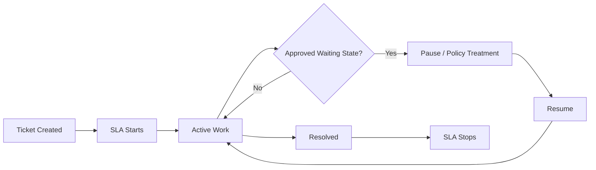

SLA behavior should be explicitly defined for each workflow state.

---

## SLA State Behavior

| State             | Typical SLA Behavior      |
| ----------------- | ------------------------- |
| New               | Running                   |
| Assigned          | Running                   |
| In Progress       | Running                   |
| Waiting on User   | Paused if policy permits  |
| Waiting on Vendor | Defined by service policy |
| Scheduled         | Defined by service policy |
| Resolved          | Stopped                   |
| Closed            | Stopped                   |

The platform should not allow arbitrary pause behavior simply to protect performance numbers.

---

## Escalation Thresholds

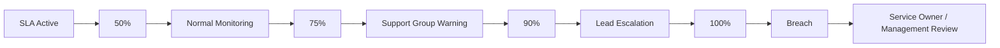

Representative thresholds:

* **50%** — normal monitoring
* **75%** — support group warning
* **90%** — lead or supervisor escalation
* **100%** — breach and service-owner visibility

P1 incidents may use more aggressive escalation.

---

## Functional vs Hierarchical Escalation

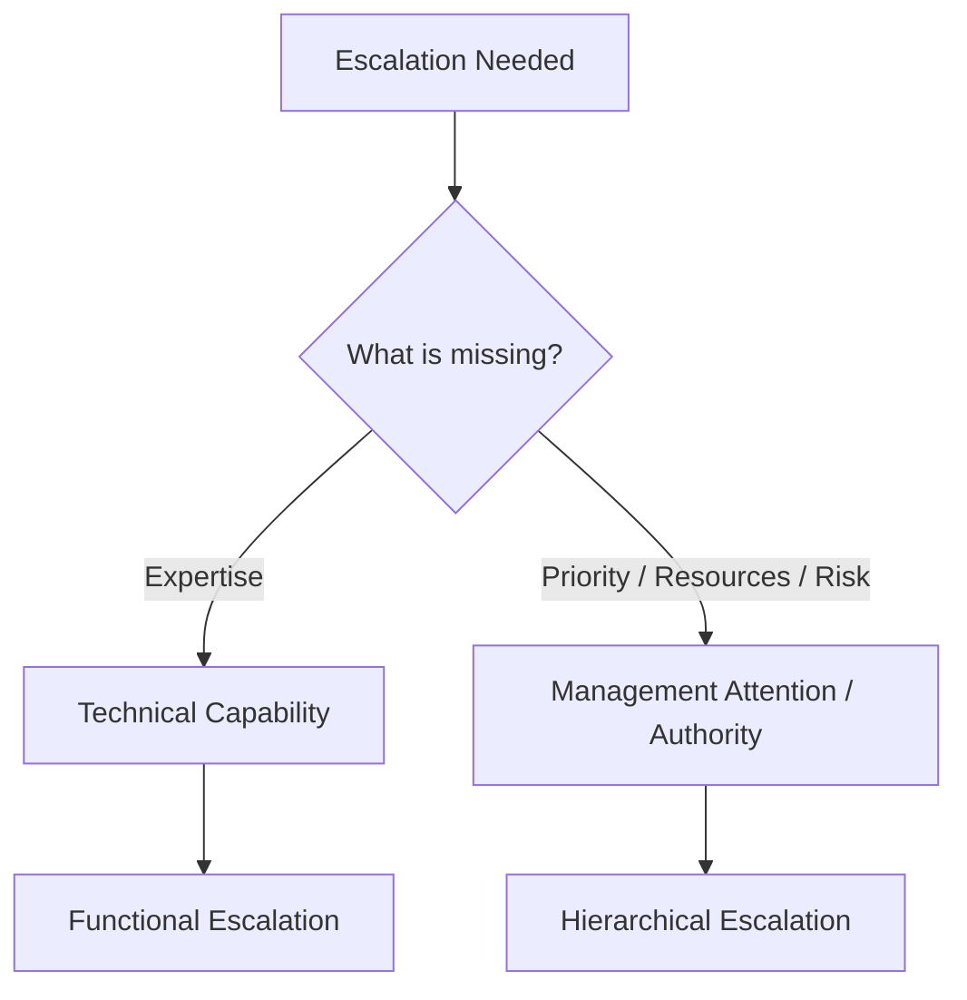

### Functional Escalation

Used when deeper or different technical capability is required.

### Hierarchical Escalation

Used when management attention, authority, prioritization, or resource decision is required.

These are different problems and should not be treated as the same escalation.

---

## Ownership During Escalation

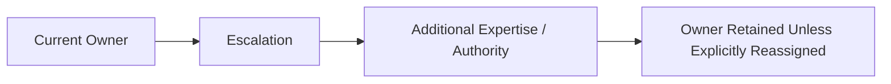

Escalation increases attention.

It does not automatically transfer responsibility.

---

## P1 Escalation

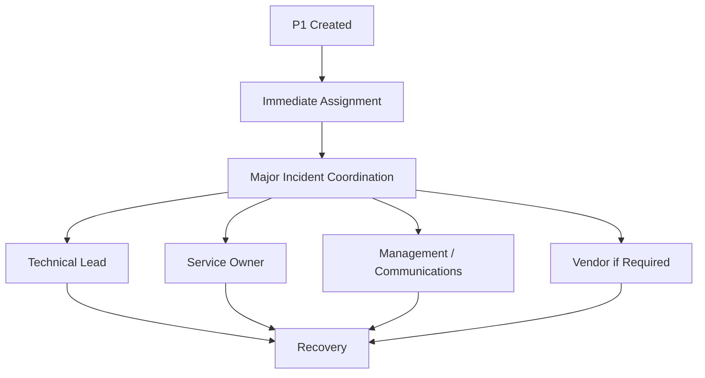

For a P1, escalation begins immediately rather than waiting for a late-stage SLA threshold.

---

## Waiting on User

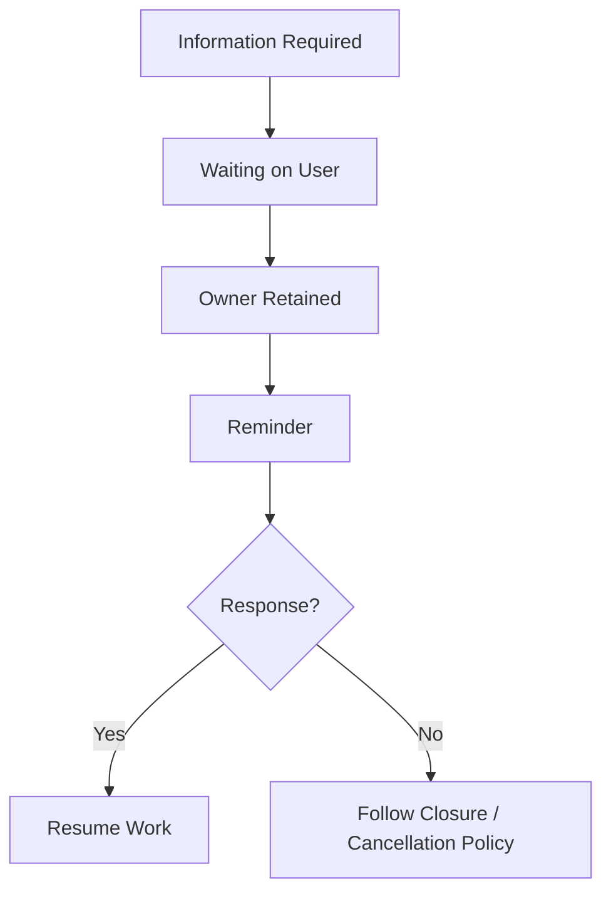

An approved pause should still remain visible in reporting.

---

## Waiting on Vendor

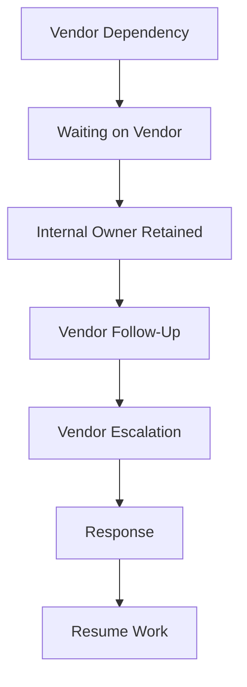

Vendor wait should not become a place where tickets disappear from operational attention.

---

## SLA Exception

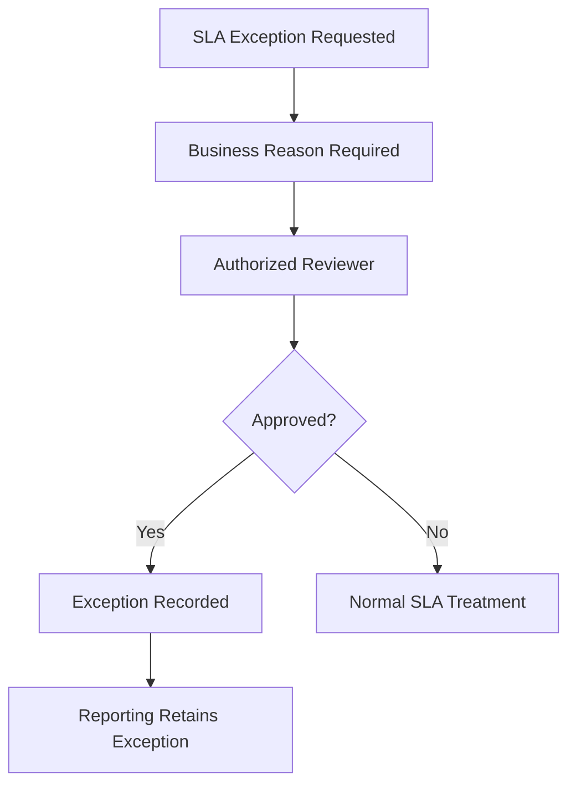

An SLA exception should include:

* authorized decision
* documented reason
* affected record or service
* timing
* audit history

It should remain reportable.

---

## Priority Override

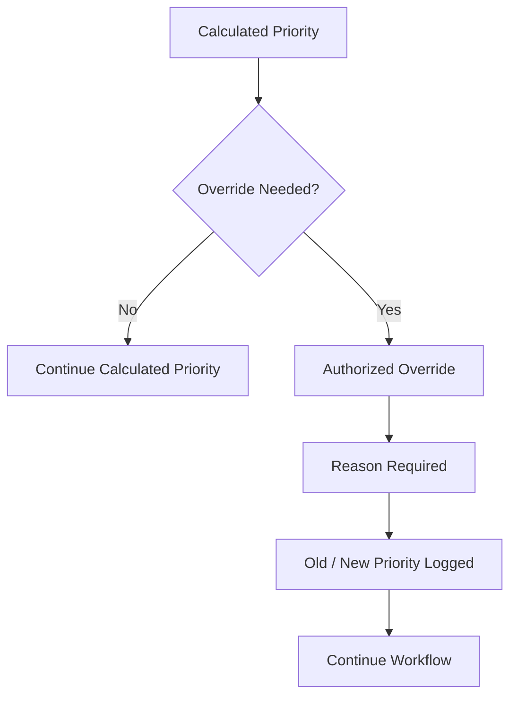

Repeated priority overrides should trigger review of either:

* the priority model
* service context
* training
* requester-pressure behavior

---

## SLA and Approval Time

Approval delay should be visible rather than automatically hidden.

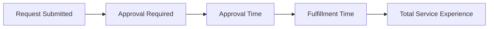

Approval and fulfillment may have different service expectations.

Separating them allows the organization to understand where delay is actually occurring.

---

## Escalation Decision Model

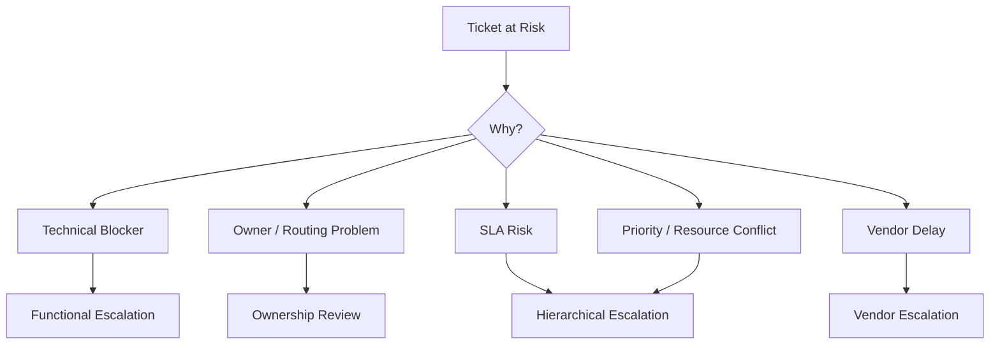

Escalation should match the actual cause of the delay.

---

## SLA Performance Interpretation

SLA metrics should be interpreted with related measures.

Example:

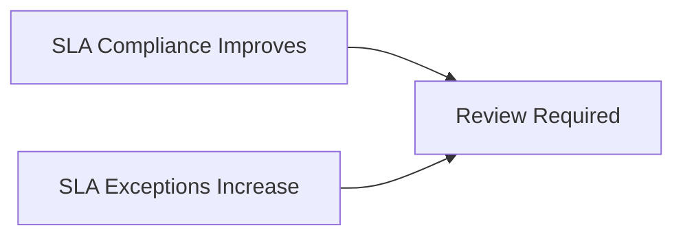

Another example:

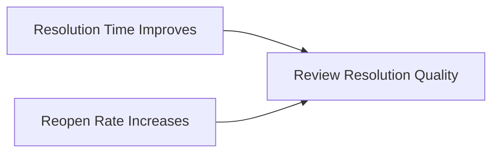

A green dashboard does not automatically mean the service improved.

---

## SLA Performance Feedback

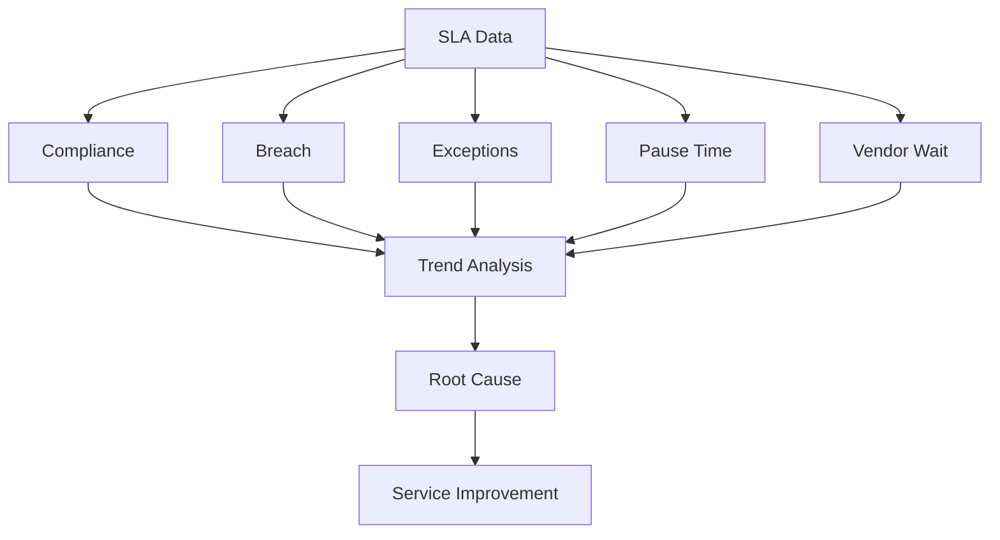

The purpose of SLA measurement is to improve service performance.

It is not to make the dashboard look better.

---

## SLA and Escalation Principle

The model can be reduced to three rules:

1. **Priority should reflect business impact and urgency.**
2. **Escalation should happen before failure where possible.**
3. **Exceptions should remain visible rather than improve the metric by hiding the problem.**

The SLA is useful when it helps the organization act.

> **Measure the commitment, expose the risk, and escalate while there is still time to do something about it.**
