# Ownership and Escalation Model

## Purpose

This diagram shows how ownership, assignment, consultation, escalation, and vendor dependency interact in the target Enterprise Service Management operating model.

The intent is to prevent a common service-management failure:

> Work moves between people or teams, but accountability becomes unclear.

The target model separates:

* who owns the record
* who is assigned the work
* who is being consulted
* who is being escalated to
* whether an external vendor is involved

Ownership should remain visible through each of those conditions.

---

## Core Ownership Model

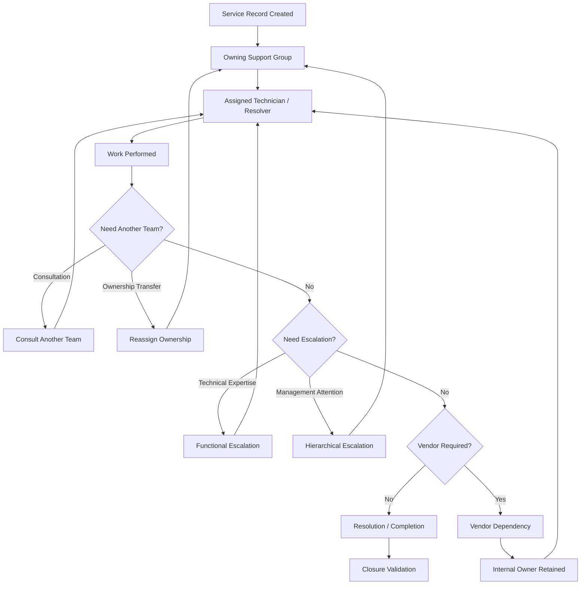

---

## Ownership Layers

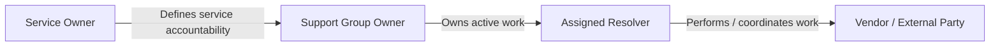

The roles are related but not interchangeable.

### Service Owner

Accountable for the service itself.

Typical responsibilities include:

* service expectations
* SLA
* escalation policy
* service performance
* major exceptions
* improvement priorities

### Support Group Owner

Operationally accountable for active work assigned to the group.

Responsibilities include:

* queue ownership
* workload
* reassignment
* escalation
* aging work
* operational completion

### Assigned Resolver

Responsible for the current technical or fulfillment action.

The assigned resolver may change without changing overall service accountability.

### Vendor

May perform technical work or provide information.

Vendor involvement should not eliminate the internal owner.

---

## Assignment vs Ownership

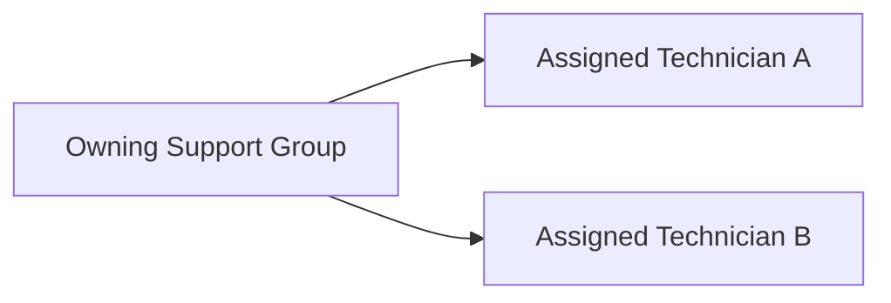

A technician assignment answers:

> Who is currently working this?

Group ownership answers:

> Which internal team remains accountable for making sure this work moves forward?

These should not be confused.

---

## Consultation vs Reassignment

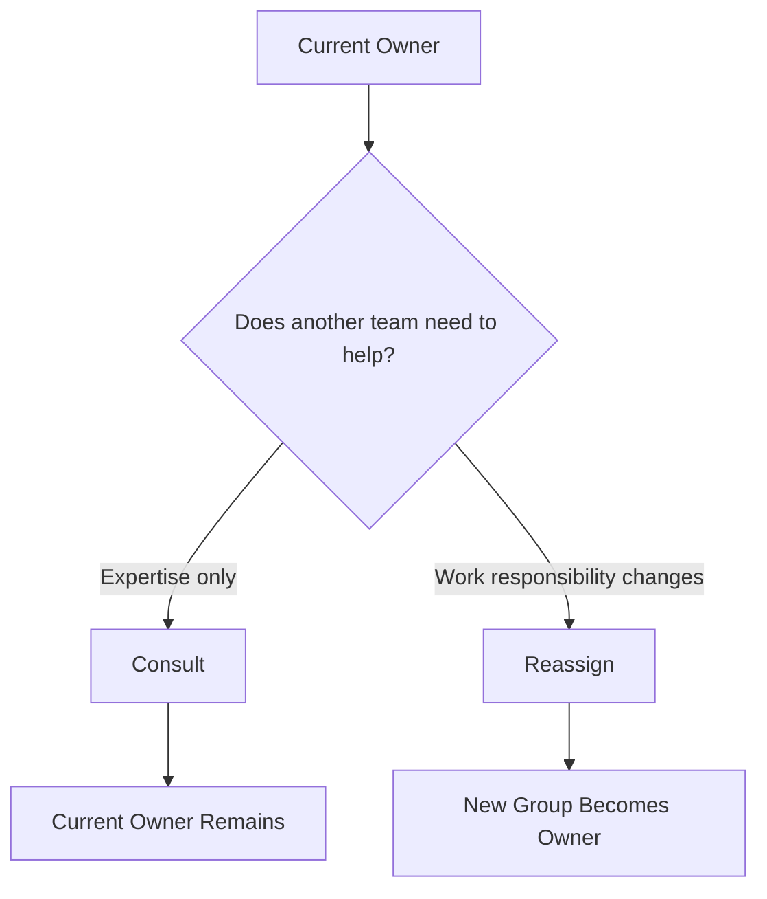

Consultation is appropriate when another team provides:

* expertise
* diagnostic assistance
* information
* a supporting task

Reassignment is appropriate when the other team becomes responsible for driving the work to the next meaningful outcome.

This distinction reduces unnecessary ticket bouncing.

---

## Functional Escalation

Functional escalation occurs when the ticket requires:

* deeper technical expertise
* specialized support
* different capability
* another operational function

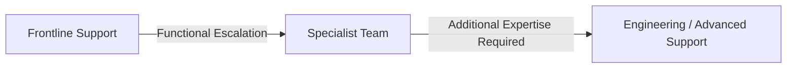

Functional escalation does not automatically require management involvement.

---

## Hierarchical Escalation

Hierarchical escalation occurs when the issue requires management attention rather than deeper technical capability.

Typical triggers include:

* SLA risk
* repeated reassignment
* priority dispute
* stalled vendor response
* resource conflict
* high business impact
* unresolved ownership conflict

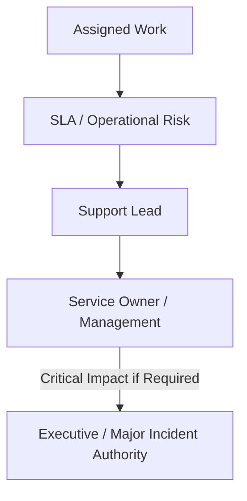

Escalation increases visibility or authority.

It should not automatically cause the original team to stop owning the work.

---

## Reassignment Model

A reassignment should require:

* valid destination
* reason
* current context
* preserved history

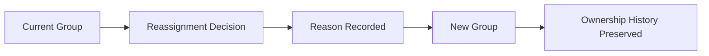

The target state should avoid:

```text id="pwi6je"
Send Ticket
   ↓
Remove From My Queue
   ↓
Hope Someone Else Handles It
```

---

## Reassignment Loop Detection

Repeated reassignment is an operational signal.

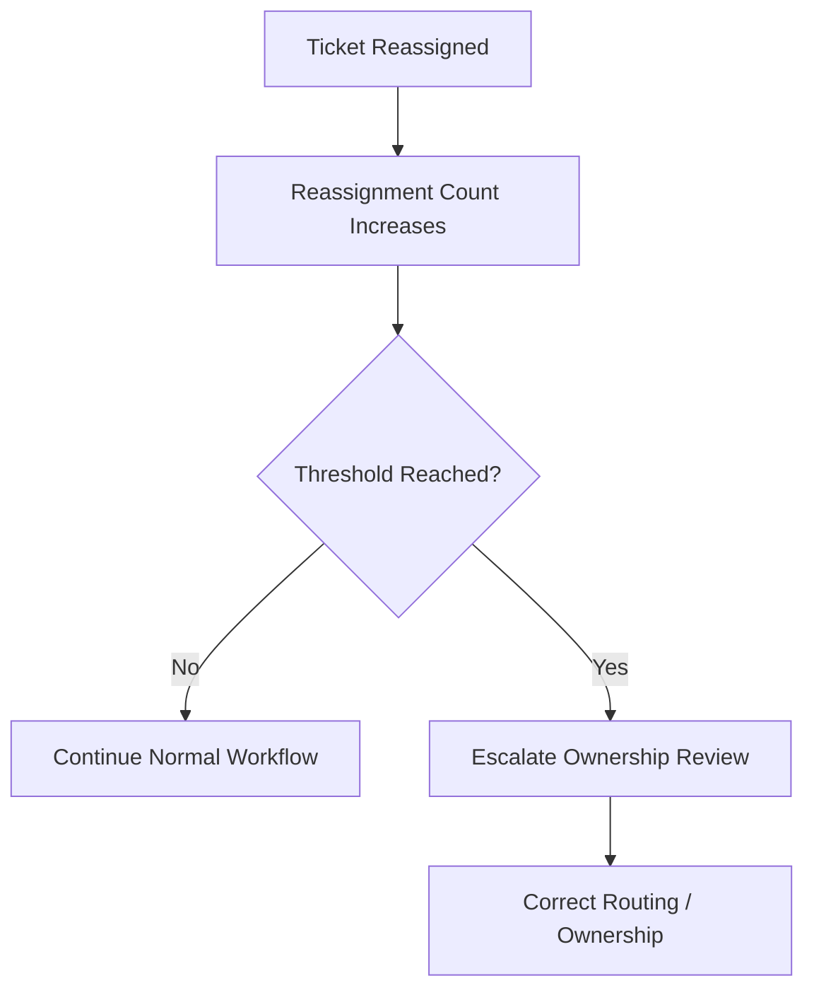

A reassignment loop may indicate:

* poor categorization
* bad service mapping
* unclear support boundaries
* weak ownership
* missing technical context

The goal should be to fix the routing problem rather than simply move the ticket faster.

---

## SLA Escalation

SLA escalation should add urgency and visibility while preserving ownership.

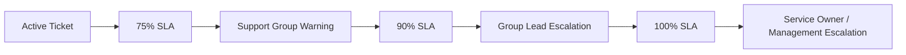

The specific thresholds may vary by service, but the principle remains the same:

> Escalation should cause action, not simply another notification.

---

## Vendor Dependency Model

External involvement is one of the places where ownership most often becomes unclear.

The target model prevents that.

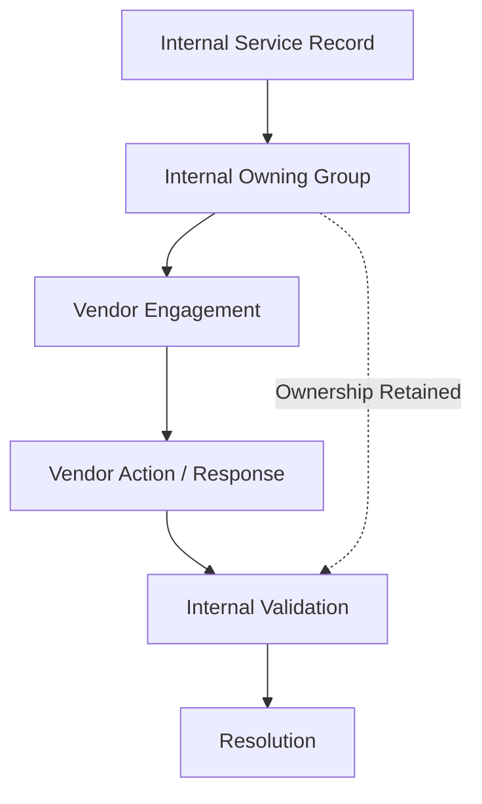

The vendor may own a contractual action.

The organization still owns the service outcome.

---

## Waiting on Vendor

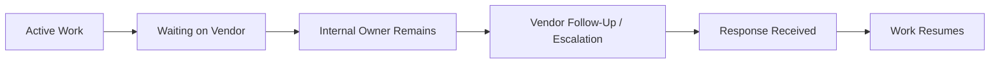

A waiting state should describe why work is delayed.

It should not remove accountability.

---

## Approval Ownership

Approval is another decision point where ownership needs to remain clear.

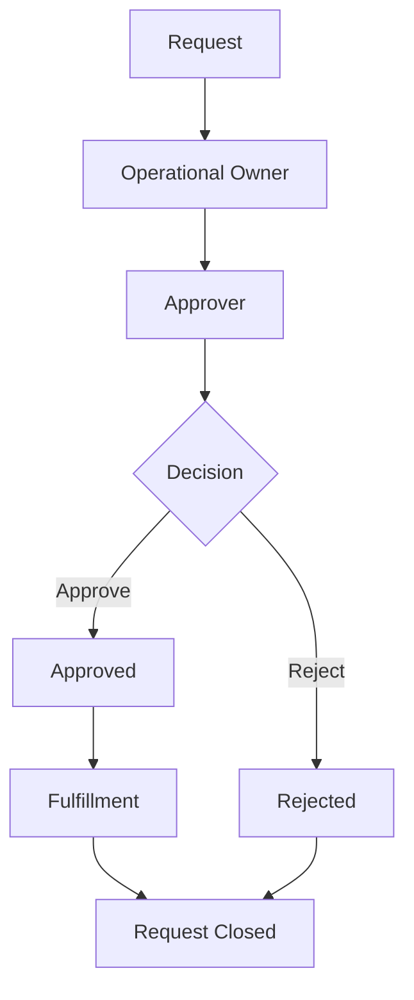

The approver owns the decision.

The operational owner retains responsibility for the request workflow.

---

## Major Incident Ownership

High-severity incidents may introduce multiple participants.

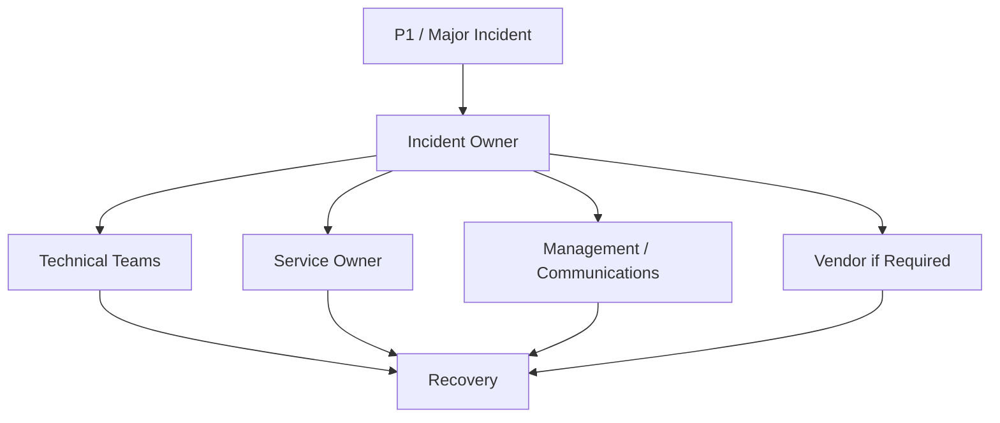

More participants should not mean less accountability.

Major Incident handling should make coordination clearer, not blur who is driving recovery.

---

## Ownership Decision Model

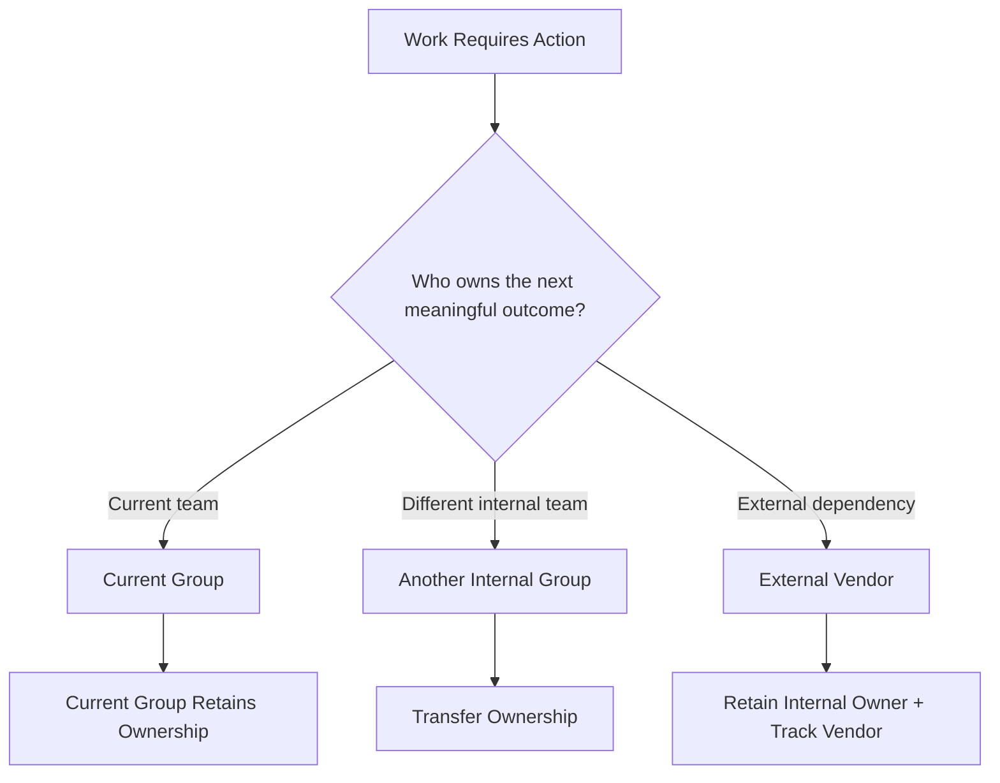

This is the central decision behind the target ownership model.

---

## Target Operating Principle

The target service model does not require the same person or team to perform every action.

It requires accountability to remain visible as work moves.

That means:

* consultation does not automatically transfer ownership
* escalation does not automatically transfer ownership
* vendor dependency does not eliminate internal ownership
* waiting states do not eliminate ownership
* reassignment requires an explicit decision
* approval responsibility is distinct from fulfillment responsibility

The model can be reduced to one operational rule:

> **Someone always owns the next move.**
