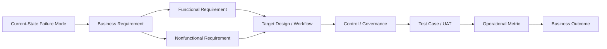
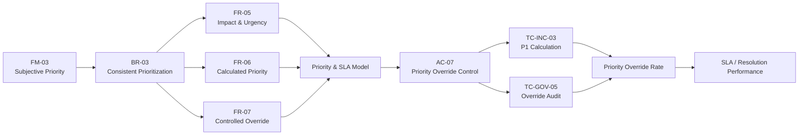
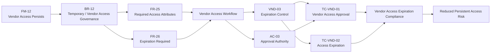
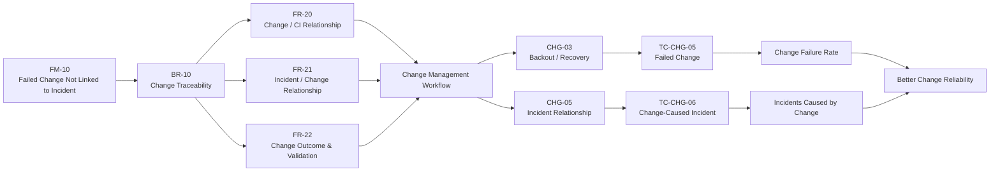
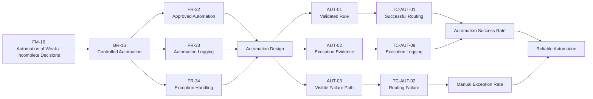
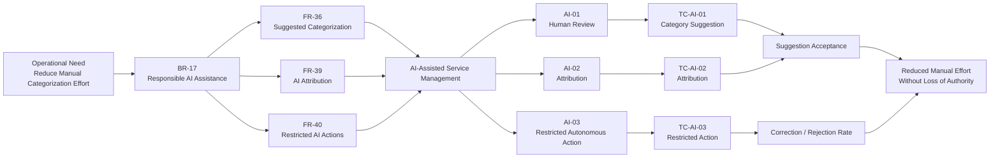

# Requirements Traceability Flow

## Purpose

This diagram shows how the case study maintains traceability from an observed operational problem through requirement definition, solution design, control implementation, validation, and measurement.

The intent is to make sure the implementation can answer a simple question:

> **Why does this requirement exist, how was it addressed, and how will we prove it worked?**



---

## Traceability Logic

The traceability chain follows:

```text
Failure Mode
    ↓
Business Requirement
    ↓
Functional / Nonfunctional Requirement
    ↓
Target Design
    ↓
Control
    ↓
Test
    ↓
Metric
    ↓
Business Outcome
```

Each stage serves a different purpose.

| Stage                                  | Question                                              |
| -------------------------------------- | ----------------------------------------------------- |
| Failure Mode                           | What is wrong today?                                  |
| Business Requirement                   | What must the organization achieve?                   |
| Functional / Nonfunctional Requirement | What must the solution do, and under what conditions? |
| Target Design                          | How will the process operate?                         |
| Control                                | How will risk and decision authority be managed?      |
| Test                                   | How will expected behavior be validated?              |
| Metric                                 | How will production performance be measured?          |
| Outcome                                | Did the change improve the operation?                 |

---

## Example 1 — Inconsistent Priority



### Intended Outcome

Priority becomes based on business impact and urgency rather than requester pressure or technician interpretation.

---

## Example 2 — Temporary Vendor Access



### Intended Outcome

Temporary access remains:

* sponsored
* approved
* time-bound
* auditable
* accountable to an internal owner

---

## Example 3 — Failed Change Traceability



### Intended Outcome

A failed change should not disappear into isolated troubleshooting.

The organization should be able to see:

* what changed
* what failed
* what service was affected
* whether an incident resulted
* what recovery occurred
* whether the same pattern is recurring

---

## Example 4 — Automation Failure



### Intended Outcome

Automation should reduce repetitive work without creating invisible failure.

If automation cannot complete safely, the work should return to a visible, owned process.

---

## Example 5 — AI-Assisted Categorization



---

## Design Principle

Traceability should not exist only because a project template asks for it.

It should make design decisions easier to defend.

If someone asks:

> Why is this control here?

the answer should trace back to a real requirement or operational risk.

If someone asks:

> How do we know the requirement was implemented?

the answer should trace forward to a test.

If someone asks:

> Did the implementation actually improve anything?

the answer should trace forward again to an operational metric.

That creates a complete implementation chain:

> **Problem → Requirement → Design → Control → Test → Measure**
