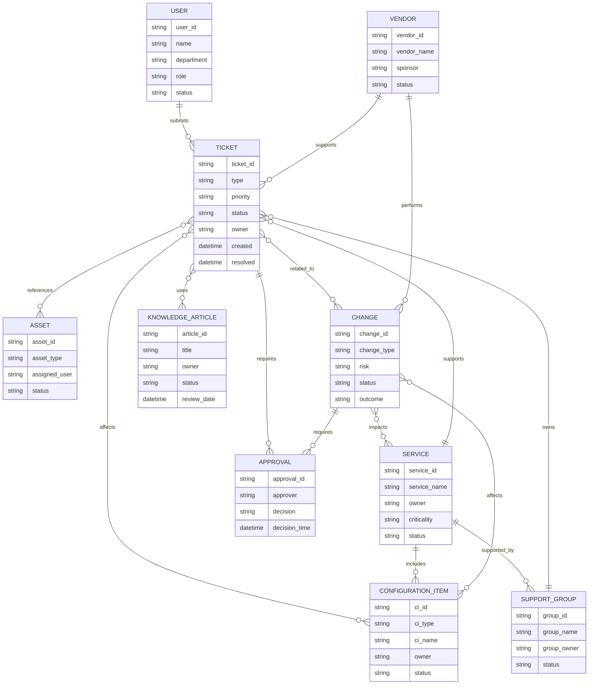
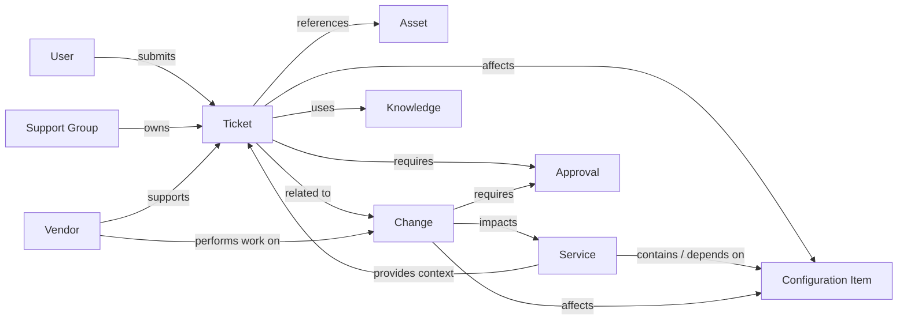
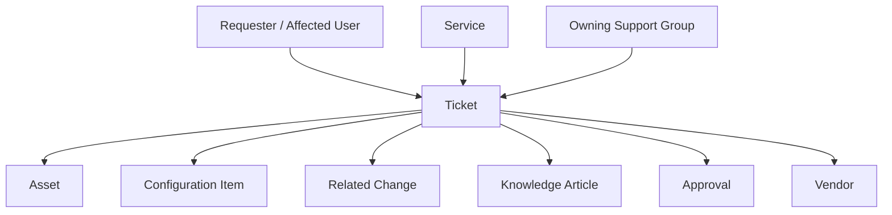
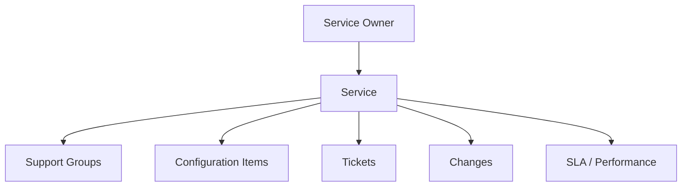
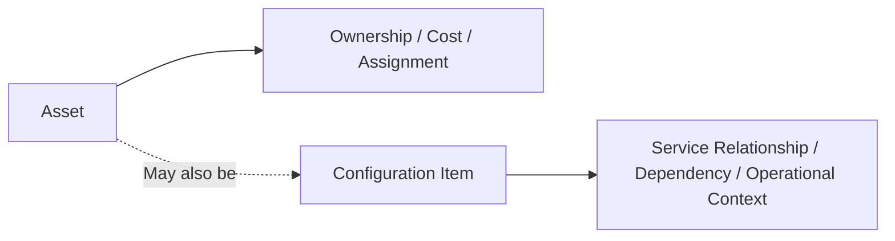
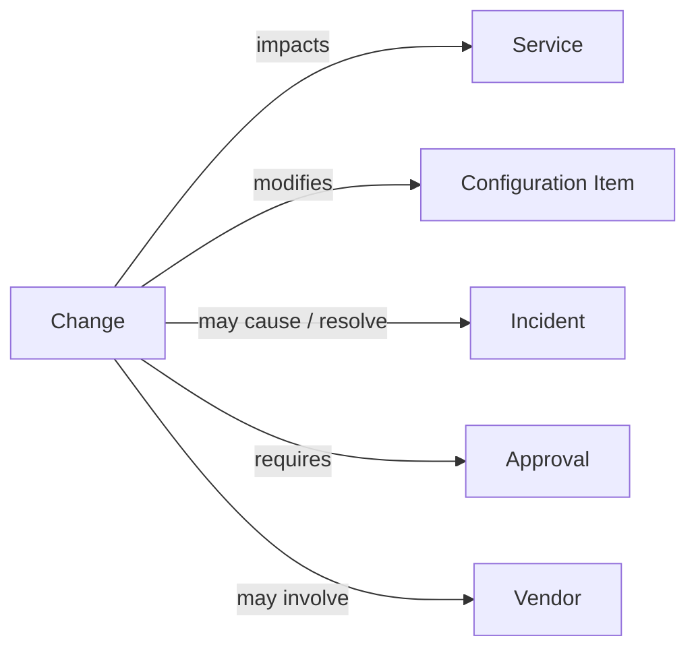
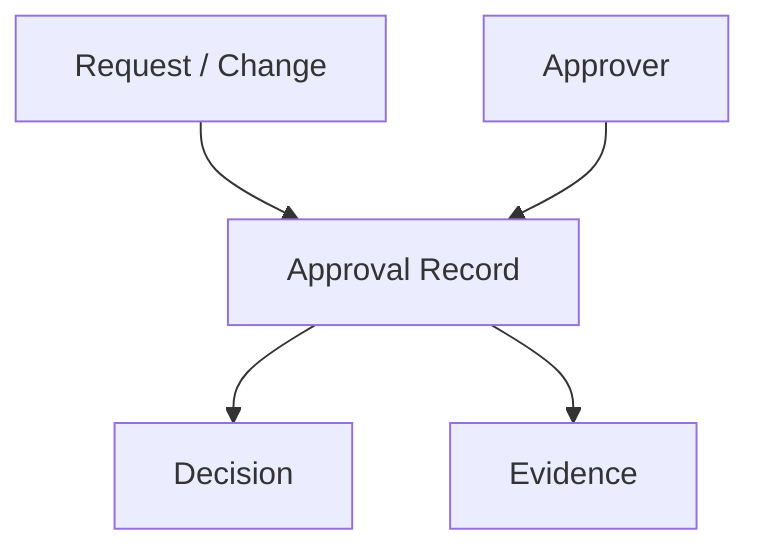
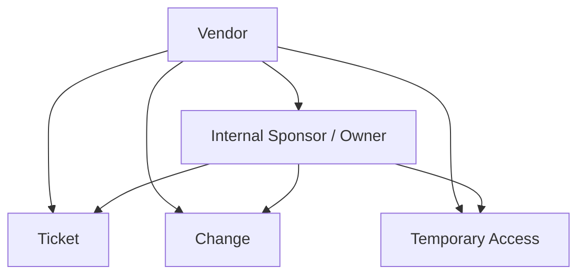
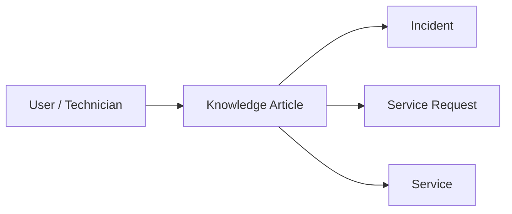
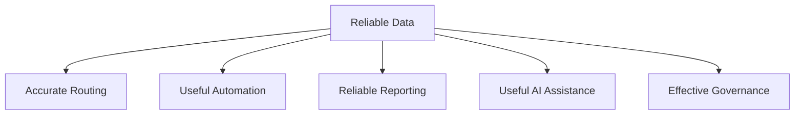

# Service Management Data Model

## Purpose

This diagram shows the core data relationships that support the target Enterprise Service Management operating model.

The goal is not to model every possible platform object.

The goal is to capture the relationships needed to support:

* service ownership
* ticket context
* approvals
* change traceability
* vendor accountability
* knowledge reuse
* reporting
* automation

The design principle is:

> **Capture relationships that support real decisions. Do not collect data just because the platform has a field for it.**

---

## Core Data Model



---

## Relationship View



---

## Core Entity Roles

| Entity             | Purpose                                                    |
| ------------------ | ---------------------------------------------------------- |
| User               | Identifies requester, affected user, approver, or operator |
| Ticket             | Authoritative service record                               |
| Service            | Connects work to a business or technical service           |
| Support Group      | Establishes operational ownership                          |
| Asset              | Represents owned physical or logical asset                 |
| Configuration Item | Represents managed service-supporting component            |
| Change             | Tracks authorized production modification                  |
| Knowledge Article  | Supports repeatable troubleshooting and fulfillment        |
| Approval           | Captures decision authority and evidence                   |
| Vendor             | Represents external dependency or service provider         |

---

## Ticket-Centered View

The ticket is the operational center of the service-management model.



The ticket should contain enough context to answer:

* who is affected
* what service is affected
* who owns the work
* what asset or CI is involved
* whether a change is related
* whether approval is required
* whether a vendor is involved
* whether knowledge was used

---

## Service-Centered View



The Service entity provides the business context that isolated tickets often lack.

It supports questions such as:

* Which service is being affected?
* Who owns that service?
* Which support teams are responsible?
* Which CIs support it?
* Which changes affected it?
* How is the service performing?

---

## Asset vs Configuration Item

Asset and Configuration Item are related concepts but serve different purposes.



### Asset

Primarily answers:

* What do we own?
* Who is it assigned to?
* What is its lifecycle status?

### Configuration Item

Primarily answers:

* What supports the service?
* What is affected?
* What changed?
* What operational dependency exists?

Not every asset needs to become a fully managed CI.

Not every CI is necessarily a traditional physical asset.

---

## Change Relationship Model



This structure supports:

* change-impact analysis
* failed-change investigation
* incident correlation
* vendor accountability
* approval history

A failed change should be traceable to the service and technical components it affected.

---

## Approval Relationship Model

Approvals should exist as structured decision records.



An approval record should retain:

* parent record
* approver
* authority context
* decision
* timestamp
* comments where required

The approval should not survive as an isolated email with no connection to the transaction it authorized.

---

## Vendor Relationship Model



External activity should remain linked to internal accountability.

The vendor may perform the work.

The organization still owns the service outcome.

---

## Knowledge Relationship Model



Knowledge relationships support:

* troubleshooting
* repeatable fulfillment
* self-service
* knowledge-gap analysis
* article usefulness reporting

---

## Data Relationship Principles

The target model follows several rules.

### Relationships Should Support Decisions

A relationship should help answer a useful operational question.

### Ownership Must Be Visible

Active services, support groups, and managed records should have a valid accountable owner.

### History Must Be Preserved

Changes in:

* ownership
* approval
* status
* configuration
* relationship

should not rewrite the historical record.

### Inactive Data Should Not Drive New Work

Inactive:

* support groups
* vendors
* services
* approvers
* configuration items

should normally be unavailable for new transactions.

Historical relationships should remain visible.

---

## Data Quality Dependencies



Weak source data creates downstream problems.

For example:

```text id="v0ixzl"
Missing Service Ownership
        ↓
Routing Failure
        ↓
Manual Reassignment
        ↓
Higher Resolution Time
        ↓
Unreliable Reporting
```

Data governance is therefore part of service management, not simply an administrative cleanup function.

---

## Reporting Relationship

The data model enables reporting across:

```text id="cv1yvh"
User
  ↓
Ticket
  ↓
Service
  ↓
Support Group
  ↓
Asset / CI
  ↓
Change
  ↓
Vendor / Approval / Knowledge
```

That supports questions such as:

* Which services generate the most incidents?
* Which groups receive the most reassignment?
* Which CIs are linked to repeated failures?
* Which changes create incidents?
* Which vendors are associated with service delay?
* Which knowledge articles are actually used?
* Which approvals are aging?
* Which services have weak ownership?

---

## Model Boundary

This is intentionally a **service-management data model**, not a full enterprise CMDB.

The case study does not attempt to model:

* every technical dependency
* every network relationship
* every software component
* every contract attribute
* every financial asset field

Those may become appropriate in a mature implementation.

The initial design captures enough structure to support the workflows and decisions defined in this case study.

---

## Target Data Principle

The service-management data model can be summarized as:

> **People → Work → Services → Technology → Decisions → Outcomes**

The value does not come from how many entities the platform can store.

It comes from whether the relationships between those entities help the organization understand and manage the service.
