# Stakeholder Influence Map

## Purpose

This diagram shows the major stakeholder groups involved in the Enterprise Service Management transformation and how their influence changes across design, implementation, governance, and ongoing operation.

The case study assumes that the primary implementation challenge is not simply identifying who participates.

It is defining:

* who requests
* who performs
* who owns
* who approves
* who governs
* who decides

The operating principle is:

> **Responsibility may already exist informally. The target model makes it explicit.**

---

## Stakeholder Landscape

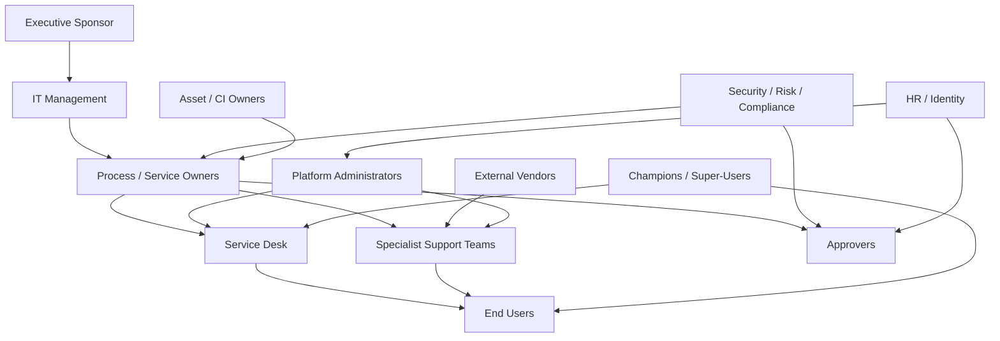

This is not intended to represent a strict reporting hierarchy.

It represents influence and operational dependency.

---

## Stakeholder Groups

| Stakeholder                  | Primary Interest                              |
| ---------------------------- | --------------------------------------------- |
| Executive Sponsor            | Business outcome and implementation support   |
| IT Management                | Service performance and operational control   |
| Process / Service Owners     | Process quality and service accountability    |
| Service Desk                 | Intake, triage, ownership, escalation         |
| Specialist Teams             | Technical resolution and fulfillment          |
| End Users                    | Simple access to service and visible status   |
| Approvers                    | Clear, timely decision authority              |
| Security / Risk / Compliance | Control, evidence, access, exceptions         |
| Asset / CI Owners            | Accurate technical relationships              |
| Vendors                      | Defined external responsibilities             |
| HR / Identity                | Joiner, mover, leaver and access context      |
| Platform Administrators      | Configured implementation of approved process |
| Champions                    | Adoption and peer support                     |

---

## Influence and Impact View

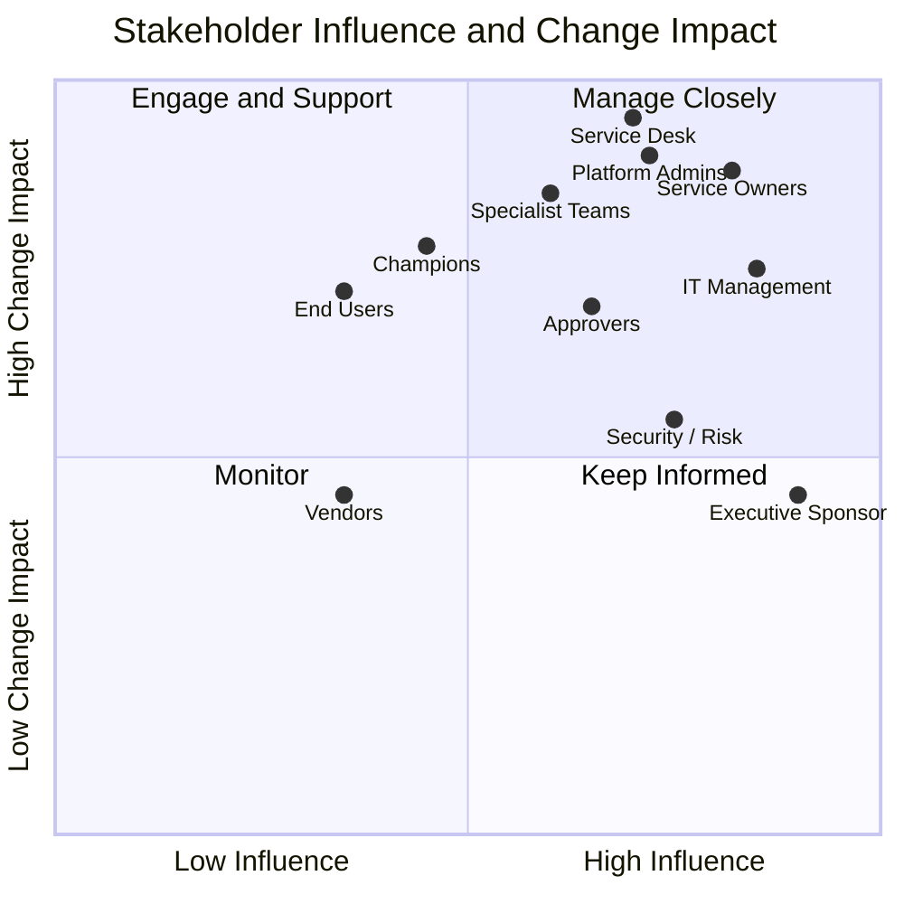

The exact placement is illustrative.

The purpose is to show that influence and operational impact are not the same thing.

For example:

* end users may have limited design authority but experience meaningful workflow change
* Service Desk personnel have both high operational impact and significant implementation influence
* executives have high decision authority but may interact with the platform very little

---

## Decision Authority

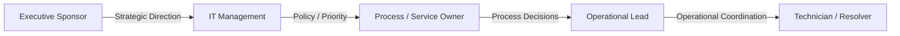

Decision authority should be placed at the level where the decision can be made responsibly.

Not every operational question should escalate to management.

Not every governance decision should be left to technicians.

---

## Service Request Stakeholders

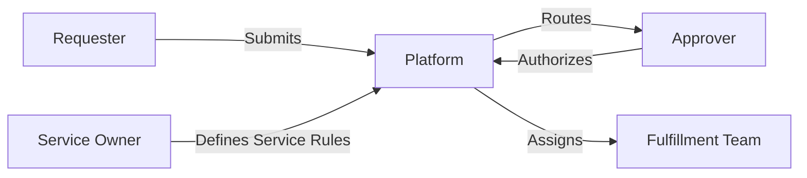

This model separates:

* requester need
* approval authority
* fulfillment responsibility
* service ownership

---

## Incident Stakeholders

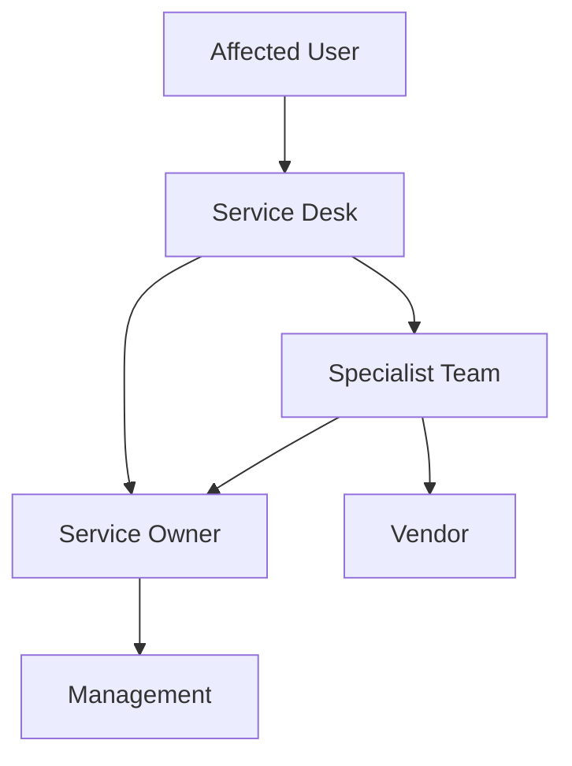

The Service Desk coordinates the record.

Specialist teams resolve technical issues.

Service ownership and management become increasingly involved as impact or escalation grows.

---

## Change Stakeholders

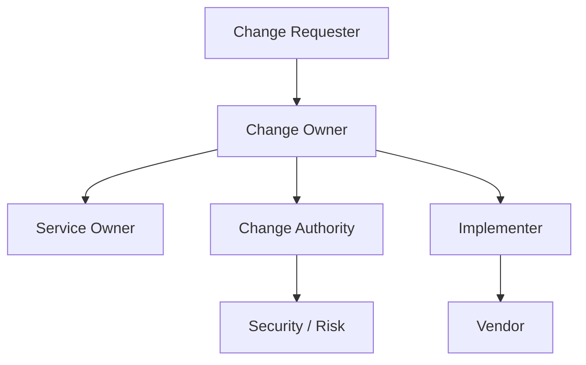

Higher-risk changes may require broader stakeholder participation.

Routine changes should not require the same decision chain as high-risk production activity.

---

## Governance Stakeholders

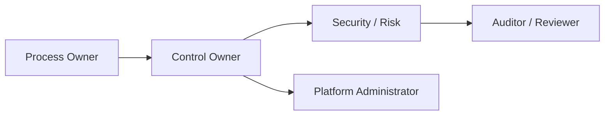

A useful separation exists between:

* defining the process
* owning the control
* configuring the platform
* reviewing the evidence

One person may fill multiple roles in a smaller organization, but the responsibilities should still remain distinct.

---

## Platform Administration Boundary

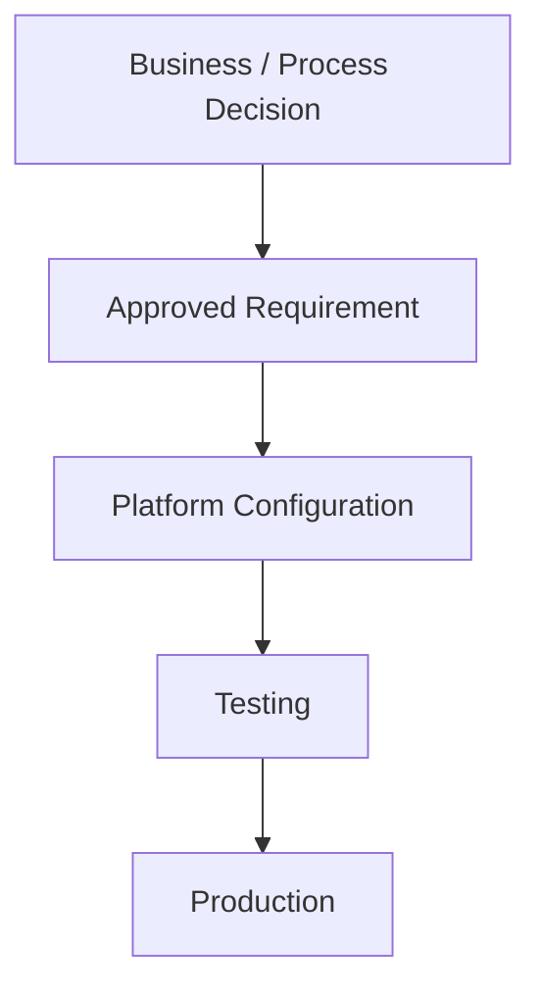

Platform administrators should implement approved process decisions.

They should not become the default authority for:

* service ownership
* approval policy
* SLA policy
* access authority
* control exceptions

Configuration capability does not automatically create business authority.

---

## Stakeholder Discovery

Stakeholder discovery should identify:

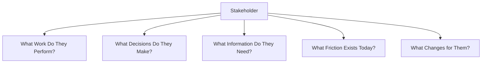

This helps keep discovery focused on operating behavior rather than feature wish lists.

---

## Adoption Influence

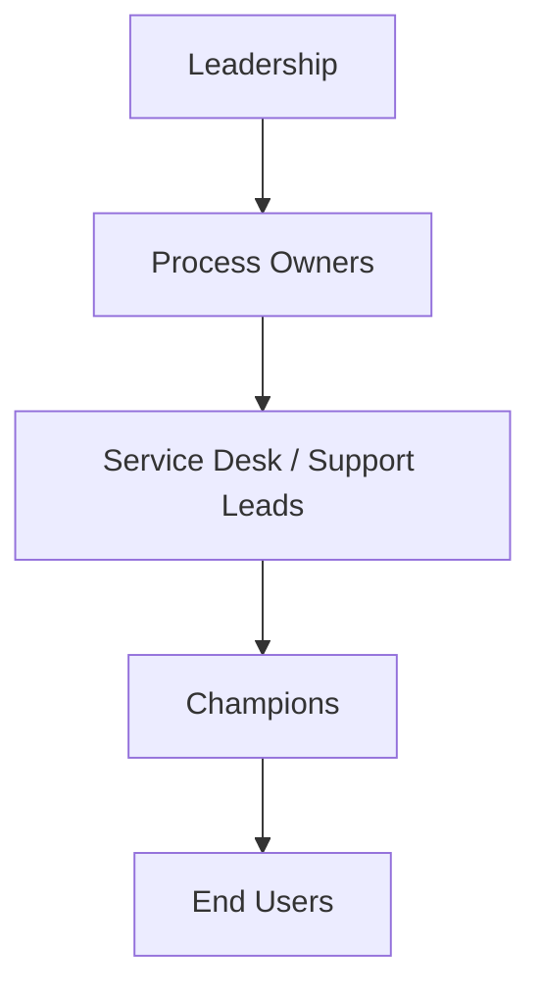

Adoption is strongly influenced by visible behavior.

If leaders and support teams continue to bypass the target process, users will learn that the new operating model is optional.

---

## Stakeholder Conflict Example

Different stakeholders may have valid but competing priorities.

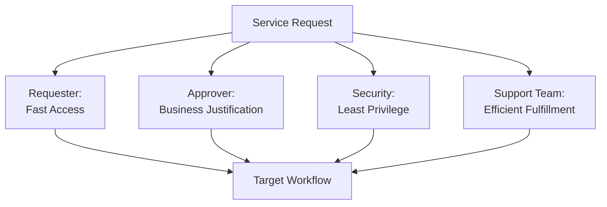

The target workflow should reconcile those needs rather than simply optimize for the loudest stakeholder.

---

## Stakeholder Engagement by Phase

| Phase          | Primary Stakeholders                                   |
| -------------- | ------------------------------------------------------ |
| Current State  | End Users, Service Desk, Support Teams                 |
| Discovery      | All affected operational and decision roles            |
| Requirements   | Process Owners, Business Analyst, Security, Operations |
| Design         | Process Owners, Platform Team, Support Leads           |
| Governance     | Control Owners, Security, Approvers                    |
| Testing        | Operational Users, UAT Participants                    |
| Implementation | Project Team, Platform Team, Operations                |
| Adoption       | End Users, Managers, Champions                         |
| Optimization   | Process Owners, Service Owners, Management             |

Stakeholder involvement should change as the implementation moves through the lifecycle.

---

## Stakeholder Principle

The target operating model should make responsibility visible enough that the organization can answer:

* Who needs the service?
* Who performs the work?
* Who owns the outcome?
* Who approves the decision?
* Who governs the risk?
* Who can change the platform?
* Who reviews whether the process is working?

The goal is not to create more roles.

It is to remove ambiguity from the roles that already exist.

> **Clear ownership makes escalation easier, governance stronger, and implementation decisions easier to defend.**
