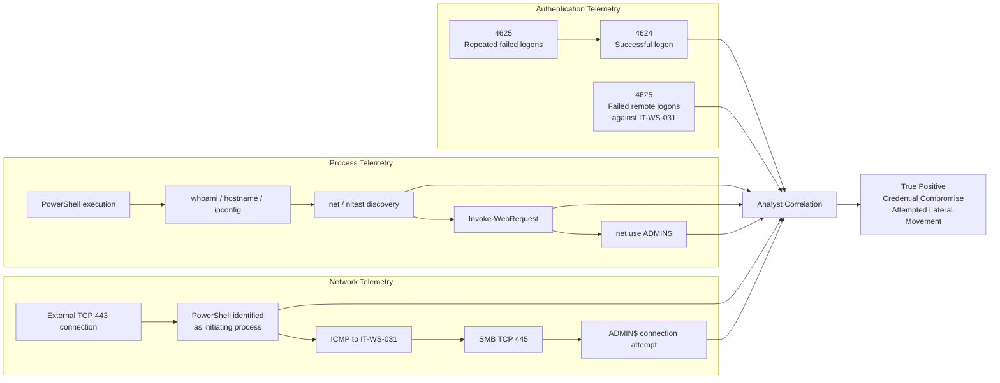

# Evidence Correlation

This diagram shows how separate telemetry sources contribute to the incident finding.

No single evidence source establishes the entire case.

## Correlation Principle

Authentication telemetry establishes that the account was used.

Process telemetry establishes what occurred during the session.

Network telemetry establishes where that activity communicated and which processes initiated the connections.

The finding becomes defensible when those sources independently support the same progression.
