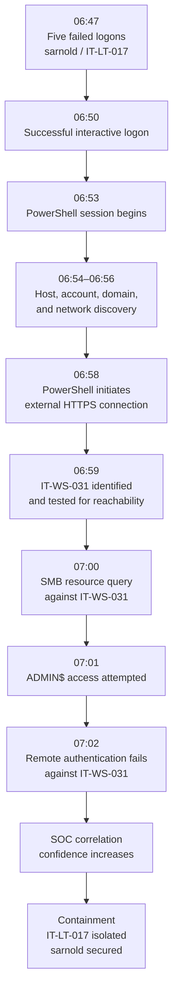

# Incident Progression

This diagram summarizes the progression of activity from the initial authentication anomaly through attempted lateral movement and containment.

## Interpretation

The investigation does not depend on a single malicious event.

The early activity remains reasonably explainable as normal IT behavior. Confidence changes as the same session progresses from authentication into discovery, unusual external communication, and attempted access to another internal endpoint.

The attempted access to IT-WS-031 is the clearest point where the activity stops fitting a routine help desk explanation.
