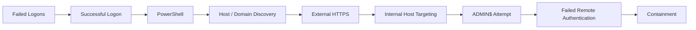
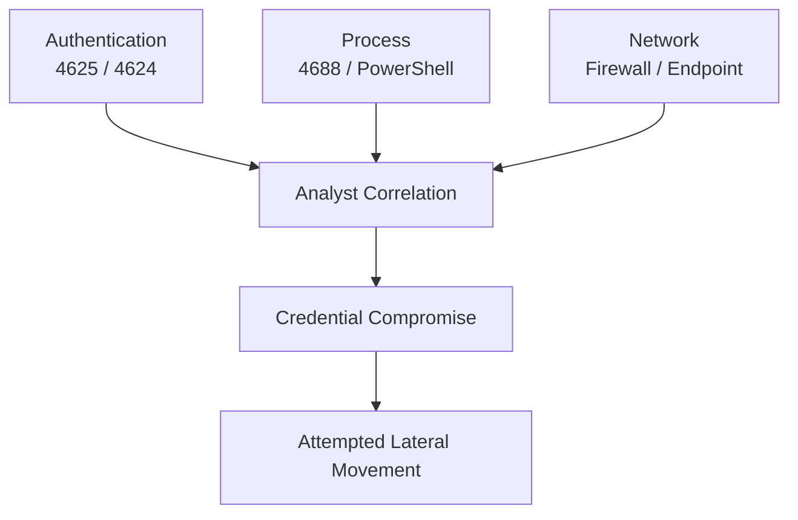

# SOC Endpoint Investigation & Security Automation Case Study

## Overview

This case study follows a synthetic Windows endpoint incident from the first SIEM alert through investigation, containment, remediation, and post-incident control improvement.

The scenario is built around a problem that is intentionally ordinary at first: repeated failed logons for a valid IT help desk account followed by a successful authentication from a shared internal laptop.

Nothing in the opening alert proves compromise.

The account belongs to an IT technician. The laptop belongs to IT. PowerShell and remote administration are normal parts of the user's job.

The case becomes an incident because of what happens next.

Authentication, process, endpoint, and network telemetry are correlated as the session progresses from successful access into system and domain discovery, unusual PowerShell-initiated external communication, internal host targeting, and an attempted ADMIN$ connection to a second endpoint.

The project is designed to show the full analyst path:

**Alert → Evidence → Investigation → CLI Analysis → Automation → Detection → Response → Control Improvement**

All organization names, accounts, hosts, addresses, logs, and incident activity are synthetic. The technical behavior is modeled around documented Windows security telemetry, Microsoft PowerShell functionality, MITRE ATT&CK, and current NIST incident-response guidance.

---

## Case Summary

Northstar Project Services is a fictional mid-sized construction and project services company with approximately 325 employees.

The incident involves:

| Item | Case Detail |
|---|---|
| Primary Account | sarnold |
| User Role | IT Help Desk Technician |
| Primary Asset | IT-LT-017 |
| Asset Type | Shared IT loaner / troubleshooting laptop |
| Secondary Target | IT-WS-031 |
| Initial Alert | Repeated failed logons followed by successful authentication |
| Initial Severity | Medium |
| Final Disposition | True Positive |
| Final Severity | High |
| Lateral Movement | Attempted |
| Secondary Compromise | Not confirmed |
| Data Exfiltration | Not confirmed |

IT-LT-017 was physically located in the help desk area, powered on, connected to the internal network, and not formally checked out to an individual when the incident began.

That detail becomes important later. The cyber evidence establishes what happened on the endpoint, but it does not establish who physically operated it. The case carries that distinction through the investigation rather than filling the gap with an assumption.

---

## Incident Progression

The full timeline is available in [Incident Timeline](03%20investigation/timeline.md).

A more detailed visual sequence is available in [Incident Progression](08%20diagrams/incident-progression.md).

---

## Project Navigation

The repository follows the same general progression as the incident lifecycle:

**Case Overview → Evidence → Investigation → Automation → Detection → Response → Post-Incident Review**

Each section can stand on its own, with cross-links included where they add useful context.

- [01 - Case Overview](01%20case%20overview/)
- [02 - Evidence](02%20evidence/)
- [03 - Investigation](03%20investigation/)
- [04 - Automation](04%20automation/)
- [05 - Detection](05%20detection/)
- [06 - Response](06%20response/)
- [07 - Post-Incident Review](07%20post%20incident/)
- [08 - Diagrams](08%20diagrams/)
- [09 - References](09%20references/)
- 
# Repository Structure

## 01 - Case Overview

The opening section establishes the environment and what the analyst knows when the alert enters the queue.

- [Incident Scenario](01%20case%20overview/incident%20scenario.md)
- [Environment](01%20case%20overview/environment.md)
- [Alert Summary](01%20case%20overview/alert%20summary.md)

The alert is intentionally ambiguous at intake. The reader is not expected to accept compromise as a starting assumption.

---

## 02 - Evidence

The evidence package contains normalized synthetic telemetry used throughout the investigation.

- [Authentication Events](02%20evidence/authentication-events.csv)
- [Process Events](02%20evidence/process-events.csv)
- [Network Connections](02%20evidence/network-connections.csv)
- [Evidence Notes](02%20evidence/evidence-notes.md)

The datasets contain both routine and incident-relevant activity.

They are not intended to reproduce the exact native export format of a particular SIEM, EDR, or firewall. Fields are normalized to keep the investigation readable while preserving realistic relationships between users, hosts, processes, authentication events, timestamps, and network connections.

The evidence package is deliberately built so that no single CSV hands the analyst the answer.

---

## 03 - Investigation

This section follows the investigation from alert validation through final analyst disposition.

- [Triage Workflow](03%20investigation/triage-workflow.md)
- [Incident Timeline](03%20investigation/timeline.md)
- [CLI Investigation](03%20investigation/cli%20investigation.md)
- [Analyst Findings](03%20investigation/analyst%20findings.md)

The CLI investigation uses standard Windows and PowerShell tooling including:

- Get-WinEvent
- Get-CimInstance
- Get-Process
- Get-NetTCPConnection
- Get-NetIPConfiguration
- Get-NetNeighbor
- Test-Connection
- Test-NetConnection
- whoami
- hostname
- ipconfig
- net
- nltest

The intent is not to turn every investigation step into a script.

Sometimes the shortest reliable command is the right tool. Automation is applied where the work becomes repetitive.

---

## 04 - Security Automation

The automation section converts repetitive parts of the manual workflow into reusable PowerShell utilities.

- [Automation Overview](04%20automation/README.md)
- [Collect-HostTriage.ps1](04%20automation/Collect%20HostTriage.ps1)
- [Find-SuspiciousLogons.ps1](04%20automation/Find%20SuspiciousLogons.ps1)
- [Export-InvestigationEvidence.ps1](04%20automation/Export%20InvestigationEvidence.ps1)

### Collect-HostTriage.ps1

Collects a focused Windows triage package including:

- host identity
- active users
- network configuration
- running processes
- TCP connections
- Event 4624
- Event 4625
- Event 4688
- security timeline
- network neighbors

### Find-SuspiciousLogons.ps1

Analyzes normalized authentication telemetry for repeated failures followed by a successful authentication within a configurable time window.

The script identifies candidates for review.

It does not decide whether the activity is malicious.

### Export-InvestigationEvidence.ps1

Packages selected evidence into a case-specific directory, calculates SHA-256 hashes, and generates an evidence manifest.

The hashing workflow demonstrates basic evidence-integrity handling without presenting the package as a formal forensic acquisition or legal chain-of-custody process.

---

## 05 - Detection

The detection section asks what the environment should recognize more effectively the next time the same behavior develops.

- [Detection Logic](05%20detection/detection%20logic.md)
- [MITRE ATT&CK Mapping](05%20detection/mitre%20attack%20mapping.md)
- [Detection Tuning Recommendations](05%20detection/tuning%20recommendations.md)

The original authentication rule is not treated as a failure.

It correctly generated a medium-severity alert.

The larger opportunity is correlation.

A failed password is common.

PowerShell is common.

TCP 443 is common.

SMB is common.

What matters is when those events begin forming a sequence that no longer makes operational sense.

### Mapped ATT&CK Behaviors

The case includes evidence-supported mappings for:

- T1078.002 - Valid Accounts: Domain Accounts
- T1059.001 - Command and Scripting Interpreter: PowerShell
- T1033 - System Owner/User Discovery
- T1016 - System Network Configuration Discovery
- T1087.002 - Account Discovery: Domain Account
- T1482 - Domain Trust Discovery
- T1135 - Network Share Discovery
- T1018 - Remote System Discovery
- T1021.002 - Remote Services: SMB/Windows Admin Shares

The mapping intentionally stops where the evidence stops.

For example, the case documents attempted lateral movement because that is what the telemetry supports. It does not claim successful compromise of IT-WS-031.

---

## 06 - Response

The response section documents the transition from investigation into containment, recovery, and remediation.

- [Incident Disposition](06%20response/incident%20disposition.md)
- [Containment](06%20response/containment.md)
- [Remediation](06%20response/remediation.md)

Immediate response actions include:

- isolate IT-LT-017
- secure the sarnold account
- revoke active sessions
- validate IT-WS-031
- preserve relevant evidence
- expand account and endpoint searches
- review shared-device custody and physical context

The response stays proportionate to the evidence.

IT-WS-031 is investigated as a targeted system, not automatically declared compromised.

The entire domain is not treated as breached because one account and one endpoint are confirmed affected.

---

## 07 - Post-Incident Review

The final analytical section looks at what the organization should learn from the incident and what should actually change afterward.

- [Lessons Learned](07%20post%20incident/lessons%20learned.md)
- [Control Improvements](07%20post%20incident/control%20improvements.md)

The primary improvement areas are:

- authentication and post-logon correlation
- administrative account baselining
- least privilege
- process-to-network attribution
- Windows logging coverage
- cross-host authentication detection
- shared-device custody
- unattended workstation locking
- SIEM enrichment
- help desk physical-access review
- SOC automation

The objective is not to react to one incident by locking down every administrative tool.

The better controls improve context, attribution, correlation, and privilege without preventing IT staff from doing legitimate work.

---

## 08 - Diagrams

The diagrams provide quick visual paths through the case.

- [Incident Progression](08%20diagrams/incident-progression.md)
- [Evidence Correlation](08%20diagrams/evidence-correlation.md)
- [Investigation and Response Flow](08%20diagrams/investigation-response-flow.md)
- [Control Improvement Map](08%20diagrams/control-improvement-map.md)

Each diagram answers a different question:

**What happened?**  
Incident Progression

**How was it established?**  
Evidence Correlation

**How was it handled?**  
Investigation and Response Flow

**What changes afterward?**  
Control Improvement Map

---

## 09 - References

Primary technical references are collected in:

[References](09%20references/references.md)

The case is grounded primarily in:

- Microsoft Windows Security Auditing
- Microsoft PowerShell documentation
- MITRE ATT&CK Enterprise
- NIST SP 800-61 Rev. 3
- RFC 5737 documentation address space

The technical references support event semantics, PowerShell functionality, ATT&CK classification, incident-response structure, and synthetic network addressing.

---

# Evidence Correlation

The central finding in the case is built from multiple evidence sources.

Authentication telemetry establishes that the account was used.

Process telemetry establishes what happened during the session.

Network telemetry establishes where the session communicated.

The finding becomes defensible when those sources support the same progression.

That is the core of the project.

---

# Technical Focus

This case study demonstrates practical work across several areas:

### SOC Operations

- alert validation
- evidence correlation
- timeline construction
- incident disposition
- severity reassessment
- containment decisions
- scope validation

### Windows Security

- Event 4624
- Event 4625
- Event 4688
- authentication analysis
- process creation
- SMB / ADMIN$ activity
- Windows administrative utilities

### PowerShell and CLI

- Windows event querying
- process inspection
- TCP connection analysis
- PID-to-process correlation
- network configuration review
- structured PowerShell objects
- CSV import/export
- parameterized scripts
- validation and error handling
- SHA-256 evidence hashing

### Detection Engineering

- failed-successful authentication correlation
- behavioral sequencing
- process-to-network attribution
- cross-host authentication correlation
- explainable scoring concepts
- false-positive considerations
- administrative-account baselining

### Incident Response

- containment
- credential remediation
- endpoint isolation
- secondary-host validation
- evidence preservation
- recovery criteria
- lessons learned
- control ownership

---

# What This Case Does Not Claim

This is a synthetic case study.

It is not presented as:

- production incident data
- a live SIEM deployment
- a malware reverse-engineering exercise
- a forensic acquisition
- a penetration test
- proof of successful lateral movement
- proof of command-and-control infrastructure
- proof of data exfiltration

The case is intentionally narrower than that.

The objective is to demonstrate a defensible investigation using realistic Windows security behavior, structured evidence, command-line analysis, automation, detection logic, and incident-response decision making.

Where the evidence does not support a conclusion, the case leaves the question open.

---

# Key Takeaway

The initial alert in this case is not especially dramatic.

That is the point.

Most SOC investigations do not begin with a banner telling the analyst that a workstation is compromised.

They begin with something that may have a reasonable explanation.

The analyst's job is to determine whether that explanation survives contact with the rest of the evidence.

In this case, it does not.

The useful signal appears when authentication, process, and network activity are put in order and the sequence stops looking like normal help desk work.

The automation supports that investigation.

It does not replace it.
